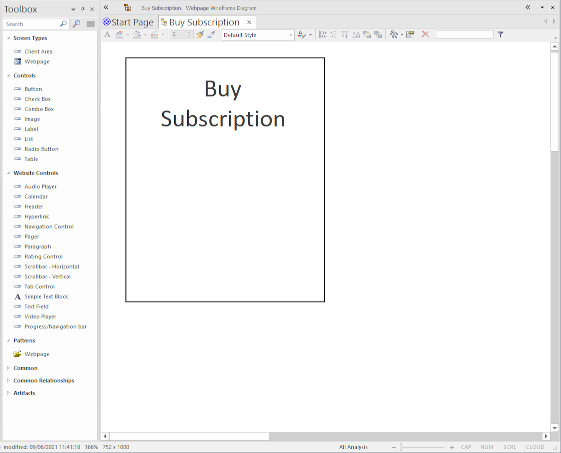
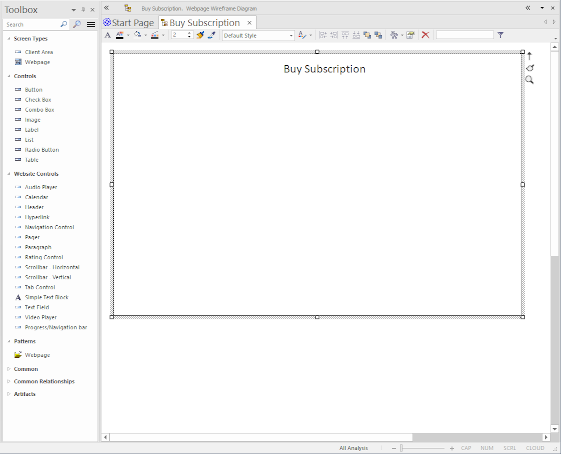
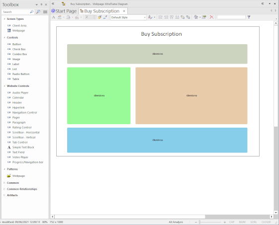
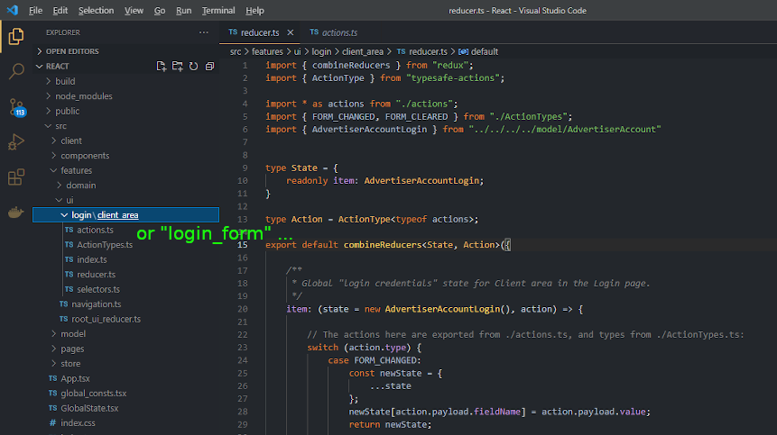
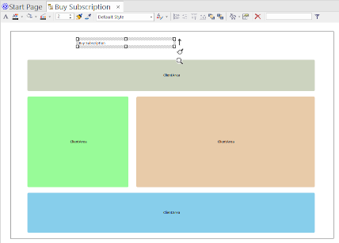
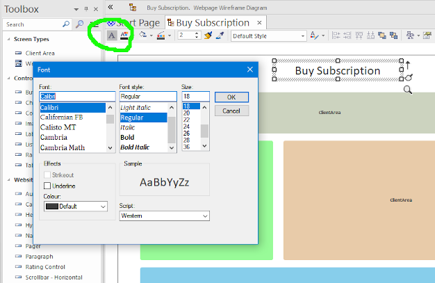
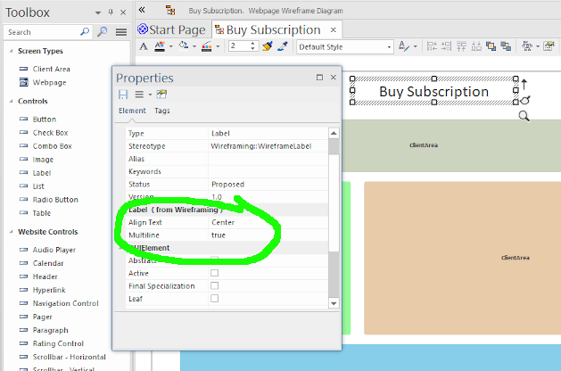

# UX Modeling Tips

## Make the wireframe shape resemble the shape of the page you're designing

That is to say, don't necessarily assume that the page has a particular shape - it's headed for a resizable web browser, after all, and users can stretch and resize their browser windows to any shape or size they like (as long as it's rectangular, of course...).

However, it still pays to start off with wireframe dimensions that resemble the page layout you have in mind.

There's a tendency for people to start with a wireframe along these lines:

The trouble is, as more items are added, space gets "scrunched up" quite quickly, and the dimensions work against creating a page layout that has room to breathe.

Instead, start with a more zoomed-out overview - literally, zoom out of the wireframe - and start with something like this:

> Use Ctrl+scroll-wheel to zoom in or out of the wireframe.

This sort of "bird's-eye view" allows you to add containers and components without having to constantly rearrange and resize things to make room...

... which leads neatly to the next tip:

## Start by adding empty containers to get a feel for the overall layout

In fact, use containers prodigiously to define the overall page structure and layout.

In UX design, there's the "mobile first" school of thought - which, to be honest, every UX designer should follow! The idea is to start by designing the page for mobile, then "building out" from there to make sure the layout also works well on desktop browsers and applications.

However, here we're more looking at an expansive desktop layout first. We can trust that react-bootstrap (which CodeBot UX targets for web-apps) uses responsive layouts, so - in the above example - containers will resize and "flow" down to the next row depending on the available real-estate.

## Name all your components, including containers

Using EA, the default component names reflect the component type - `Combobox`, `ClientArea` etc. This doesn't cause a problem as such, but CodeBot does use these names in the generated React and Redux code:

Of course, this won't affect the visible page at all, but for overall clarity and "good form" you might still want to rename the components based on their domain-driven role. For example - as in the above screenshot - rename a login `Client Area` to "Login Form". This can really help when you're customising page styles or exploring/reusing the generated code - it's easier to find a container called "Login Form" than the fifteenth "Client Area"!

> Don't worry about whether to use `snake_case`, `CamelCase` etc in the model names - always just use "Natural language" naming, i.e. "Login Form" instead of "login_form". It's more pleasant to work with, especially as the model is positioned at the "business domain" level rather then the solution-space or implementation level. When CodeBot runs, it'll "case" the names appropriately depending on what's being generated.

## Make the wireframe closely resemble the generated page

This one might sound a bit reversed; but the idea is that you style the generated page with custom CSS - in effect, this is applied after the code is generated and the application is built. This can result in wireframes that look remarkably unlike the page being generated (aside from basic layout and the choice of components etc). So, from a UI design perspective, it makes sense to at least keep the wireframes resembling the target styling.

For example:

### Page headings and subheadings

To define a heading, you create a normal `Label`, then add a `css class` tag with the value `h1` (or `h2`, `h3`, ... etc).

However, left as-is, the "heading" label in the wireframe just won't look like a heading:

So you'll ideally want to adjust the label size in the wireframe to a more suitable "heading-like" size.

Based on the default Calibri font, we recommend standardising on 18pt size for h1, 14pt for h2, and so on down.

As headings are usually centred and can word-wrap, it's worth making sure the wireframe headings do likewise:

This also allows the heading component to be positioned more "sensibly" on the wireframe, e.g. if it's made full-width, the text is still centred.

### Customising the wireframe appearance some more

In EA, you can further customise the appearance of components as follows:

1. Make sure the diagram isn't in "whiteboard mode" or using some other global style/theme - right-click on the diagram, choose `Properties`, and make sure `Whiteboard Mode` is unchecked.
2. Right-click on a component and choose `Appearance > Enable custom draw style`.
3. Use the style toolbar at the top of the diagram to change the component's appearance.

> To set the background colour on a container, you may need to set both the "fill" colours to the exact same colour.
