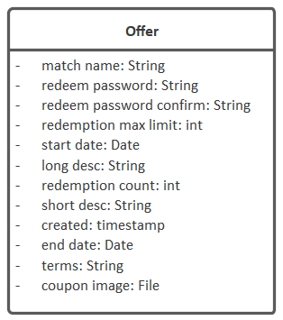

Here's a typical domain class added in Enterprise Architect (EA):

The attribute types (`string`, `int` etc) do have an influence on the generated system, so it's important to give some consideration to the data types when adding attributes to your domain class.

# Data types recognised by CodeBot

The following data types are recognised by CodeBot. As with "everything CodeBot", this list grows over time; however we'll keep this page updated with all the supported data types:

| Data type | Pseudonyms      | Notes          |
| --------- | --------------- | -------------- |
| `boolean`   | `bool`            |                |
| `string`    | `char`, `char[]`    |                |
| `integer`   | `int`             |                |
| `long`      |                 |                |
| `float`     |                 |           |
| `double`    | `number`, `decimal` | Depending on the output target (e.g. JavaScript), all the numeric types may resolve to a common type such as "number" |
| `date`      |                 | Just the date with no time |
| `time`      |                 | Time of day with no date |
| `datetime`  | `timestamp`       | Date and time  |
| `file`      |                 | Triggers a file upload capability in the REST API. The value stored in the record is simply the original filename. |

All the data types are case insensitive - so you can define them in your model as `Bool`, `BOOL`, `bool` etc.

# Types mapped to output targets

Each data type is mapped to an equivalent type in the output target (language, database etc).

## MongoDB (BSON) types

| Data type | BSON type |
| --------- | --------- |
| `boolean`   | `bool`      |
| `string`    | `string`    |
| `integer`   | `int`       |
| `long`      | `long`      |
| `float`     | `decimal`   |
| `double`    | `decimal`   |
| `date`      | `date`      |
| `datetime`  | `date`      |
| `time`      | `date`      |

## SQL types

| Data type | SQL type     |
| --------- | ------------ |
| `boolean`   | `BOOLEAN`      |
| `text`      | `TEXT`         |
| `string`    | `VARCHAR(255)` |
| `integer`   | `INT`          |
| `long`      | `BIGINT`       |
| `float`     | `FLOAT`        |
| `double`    | `DOUBLE`       |
| `date`      | `DATE`         |
| `datetime`  | `DATETIME`     |
| `time`      | `TIME`         |
| `timestamp` | `TIMESTAMP`    |

## JSON types

| Data type | JSON type |
| --------- | --------- |
| `boolean`   | `boolean`   |
| `string`    | `string`    |
| `integer`   | `integer`   |
| `long`      | `long`      |
| `float`     | `number`    |
| `double`    | `number`    |
| `date`      | `string`    |
| `datetime`  | `string`    |
| `time`      | `string`    |

## Java types

| Data type | Java type  |
| --------- | ---------- |
| `boolean`   | `boolean`    |
| `string`    | `String`     |
| `integer`   | `int`        |
| `long`      | `long`       |
| `float`     | `BigDecimal` |
| `double`    | `BigDecimal` |
| `date`      | `java.time.ZonedDateTime` |
| `datetime`  | `string`     |
| `time`      | `string`     |
