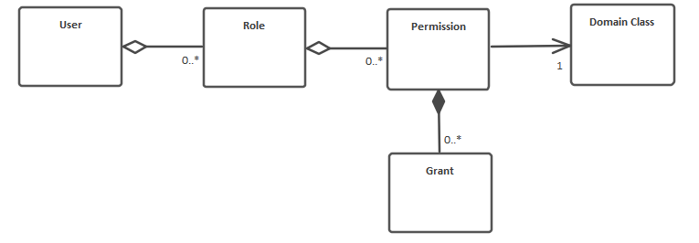

# Reference - Server API Access Control

The role-based access layer generated by CodeBot follows this structure:

The diagram can be read like this:

* Each user has zero or more roles (job functions)
* Each of those roles has zero or more permissions
* Each permission is associated with exactly one domain (a domain class)
* Each permission consists of zero or more grants

Think of a **permission** as being a group of **grants** specific to a single **domain**.

e.g. given the domain class `House` and the role `Builder`, you could assign `Builder` with these grants for `House`:

* create
* update own
* read own

Grants are assigned to a permission (the dependency arrow pointing from an Actor to a domain class) using UML **constraints**.
