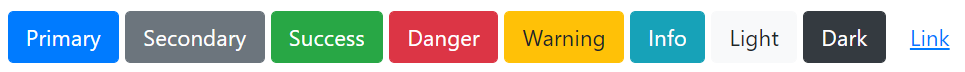

# Reference - Tagged Values

A note about tag names:
Throughout this guide you'll see tag names in "lower sentence case", e.g. `stylesheet url`. Although we recommend using this style, you can use upper case in places if preferred, or underscores, full-stops/periods and dashes in place of spaces; e.g. `Stylesheet URL` or `StyleSheet_URL` would also work. The names are all "normalised" by CodeBot before they're used.

## Variant

The `variant` tag is applicable to some UI components, primarily `Label`, `Table` and containers (`Panel`/`Client Area`). The allowed values are based on Bootstrap's variant CSS classes, as follows:

While these variants are quite Bootstrap-specific, we'll carry them over to any future UI platforms that CodeBot generates, so that the same wireframes can be reused.

## CSS Classes

The `css class` tag is applicable to all UI components. If you define a class in a custom CSS file, you can apply it to a component using this tag.

To apply more than one CSS class, either put them all in one tag separated by spaces, or create multiple `css class` tags.

CodeBot will also recognise any "standard" Bootstrap CSS classes such as `h1`, `h2` etc; their defined behaviour will be carried over to any future UI platforms that CodeBot generates.

## Common tagged values

Tag names generally are used consistently in all UI components and elsewhere; so if you're unsure which tag to use, it's pretty likely it'll be one of these. Or check the UI component reference directly for more specific details...

| Tag      | Notes                                            | Where used           |
| ---------| ------------------------------------------------ | -------------------- |
| `text`   | Text to display, if not using the component name | [Label](ui-components/label), [Button](ui-components/button) |
| `variant`   | See the above section on variants | [Label](ui-components/label), [Button](ui-components/button), [Table](ui-components/table), [Container](ui-components/container) (ClientArea) |
| `css class`   | See the above section on CSS classes | All components |
| `domain`   | Links a component to a domain class, and optionally an attribute. Depending on the component, it will then use the domain data in some way, e.g. put the items in a list for selection. | [Data-linked components](../codegen-process-guide/UX/data-linked-components) |
| `bind`   | Links a component to some other component. This allows the components to share and react to global application state. | [State-bound components](ui-component-binding) |
