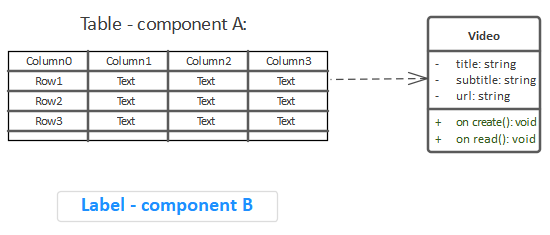
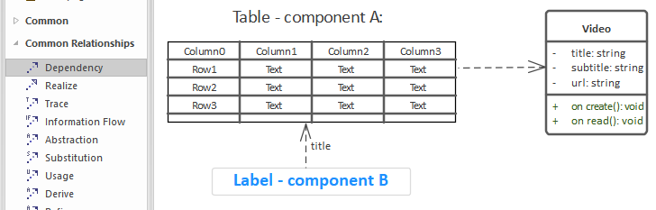
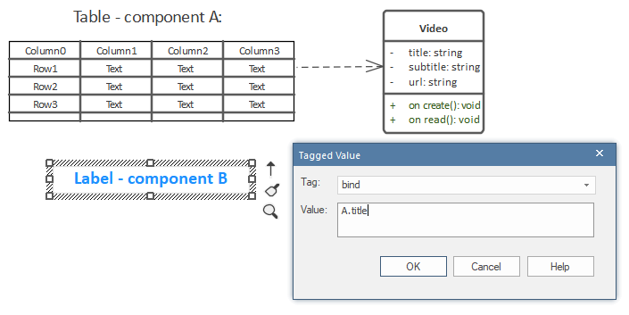
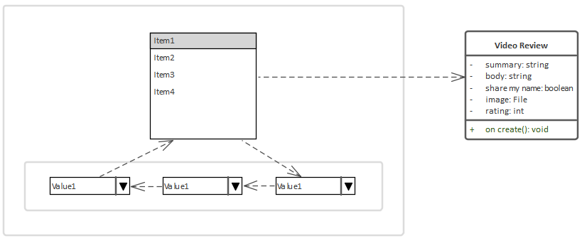
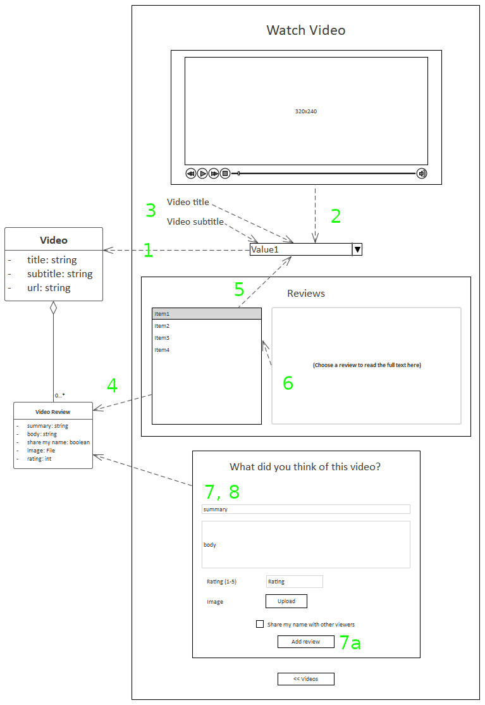

# Reference - UI State-Bound Components

A component can "listen" to change events in another component, and be updated accordingly; e.g. a Media Player could listen to a listbox of Video domain items, and update to play the selected video.

For React, CodeBot generates a reusable library of [Redux](https://redux.js.org/) Finite State Machines (FSMs) to track and maintain global state across the app, so that components on different pages can be bound to other components' UI state.

When its value changes, a component may behave slightly differently inside a form. In a form, it'll trigger a "form value changed" event rather than an individual "component value changed" event; this is to prevent the page being slowed down with fine-grained change events flying around.

However, if another component is specifically bound to a component inside a form, it should still generate an individual "component value changed" event for the listener... so in practical terms, you may not notice a difference.

## Not to be confused with [data-linked components](ui-data-linked-components)

Component binding and linking are two separate concepts (both very powerful in their own way!):

1. Components can be *linked* to a domain class, e.g. a listbox can display `Video` items, or a form can create new `Video Review`s
2. Components can be *bound* to other components (the topic of this page). When the bound component updates (e.g. item selection changed), the listening component gets the update and reacts in some way. *How* it updates depends on the combination of the two component types.

## Two ways to bind components

Let's say we have Component `A` (a table) and component `B` (a label). We want the label to display an attribute from the selected table row:

To bind Component `A` to Component `B`, either:

1. Draw a dependency arrow from `B` to `A`
2. Add a `bind` tagged value to `B`

###  1. Draw a dependency arrow from `B` to `A`

To specify which attribute the label should display, put the attribute name in the arrow name ("title" in this case). Although that's the recommended way, you can also create a `domain` tag on the label, and put the attribute name there.

> The arrow must point from `B` to `A` - in other words, `B` is dependent on `A`. If drawn the other way round, `A` would be reacting to UI changes in `B` instead.

### 2. Add a `bind` tagged value to `B`

The value should be the name of the other component, in this case `A`. The second value (after the ".") in the above screenshot is the attribute name that the label should display.

If `A` is on a different wireframe, also include the wireframe name: `Other Wireframe.A`

A bind tag can be separated into up to three parts, separated using dot notation:

1. Wireframe name
2. Component name
3. Attribute name

Out of these, only the component name is always required. The wireframe name is optional if the two components are on the same wireframe. The attribute name is also optional, but recommended. If absent, CodeBot will look for a default name depending on the component type (e.g. "url" for the MediaPlayer), and will fall-back to the first available attribute in the domain class.

## Component chaining

Should you need to, you can also chain components together:

In the above example, if a listbox item is selected, the first ComboBox's selection is updated to match, which triggers the second ComboBox to do the same, and so on to the third. Changing the selection in, say, the second ComboBox would also cause the third ComboBox to update.

Because the listbox also has a dependency on the third ComboBox, this creates a circular dependency; so, changing the selection in any of the components will cause them all to update. Removing that particular dependency would allow the third ComboBox's selection to be updated independently.

Each of the above components should have a `domain` tag defining the attribute name to display, e.g. `summary`, `rating`. The default behaviour is to show the first available attribute in the domain class.

> If the number of dependency arrows on the wireframe starts to become too much, you can also use the `bind` tag (to bind components) and `domain` tag (to link a component with a domain class).

## A fully wired-together page

This wireframe shows how to link up several components on one page:

1. The ComboBox is linked to the `Video` domain class, so will show all available `Video`s
2. The Media Player is bound to the ComboBox, so it will play whichever `Video` is selected
3. The `Video title` and `Video subtitle` labels are both also bound to the ComboBox
4. The listbox is linked to the `Video Review` domain class, so will show all available `Video Review`s. However...
5. ... it's also bound to the `Video`s ComboBox, so - because of the aggregation relationship between `Video` and `Video Review` - the listbox will only show reviews that belong to the selected video. (*NOTE: this functionality is on its way, & will be delivered very soon!*)
6. The TextArea is bound to the `Video Review`s listbox and configured to show the review text. So it'll update to show whichever review is selected in the listbox

Further down in the same wireframe:

7. The "What did you think of this video?" container is a form, because it has a submit button (7a) with a `create` action (not shown in the screenshot) *and* is linked to `Video Review`
8. (Also not shown in the screenshot), the review form is also bound to the `Video` ComboBox via a `bind` tagged value; so when the form is submitted and the review created, the new review will belong to the selected `Video`

> In item 8, we used a `bind` tag for tidiness, to avoid a dependency arrow being drawn right up & across the middle of the wireframe.
