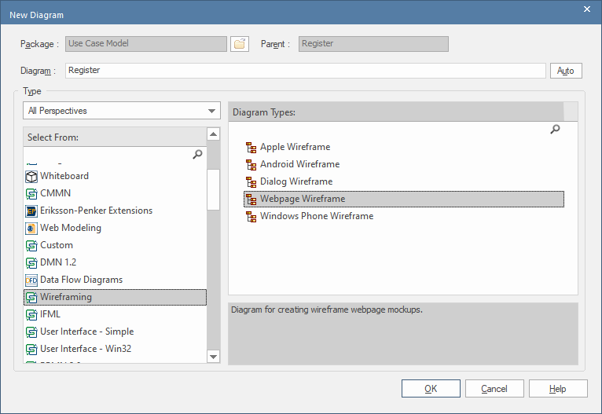
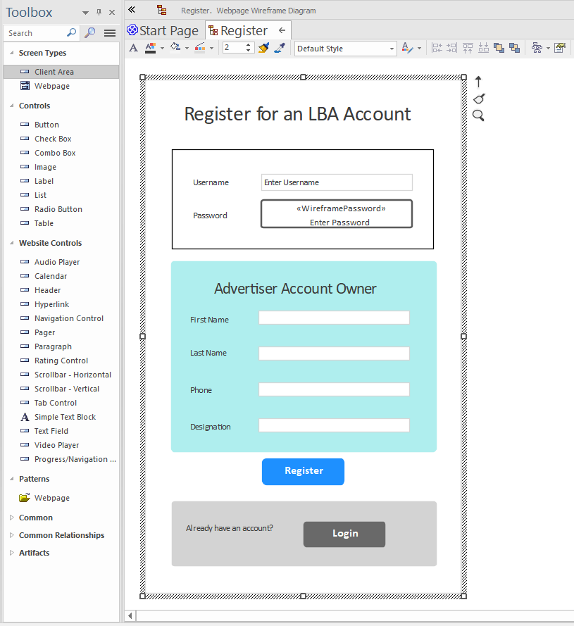
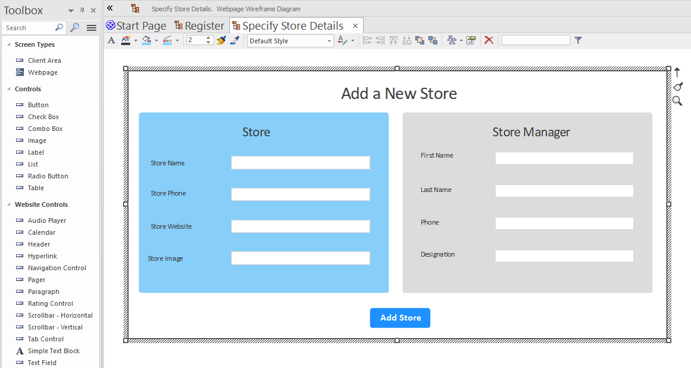

# Wireframes

Enterprise Architect (EA) includes a capable wireframe designer, which you can use to design each screen/UI identified from your use cases. CodeBot can then generate a working web application from these wireframes.

In general, you should find that you can simply "slap a bunch of components onto the wireframe editor", and CodeBot will turn it into a React.js website, complete with a responsive layout. However, in this section we'll attempt a little more nuance, to demonstrate how to get the best results :)

The first interaction a user is likely to have will probably be with the Register page, so let's design that page first.

## Create the wireframe diagram

When you create the wireframe (whether via the Project Browser or as a sub-diagram beneath a use case), the diagram type you choose is important:

With EA, CodeBot looks specifically for the `Webpage Wireframe` diagram type (on the right), located beneath `Wireframing` (on the left). Support for other wireframe types will be added at some point, but currently the diagram type must be Webpage Wireframe. (For MagicDraw, choose `User Interface Modeling Diagram`).

## Create a panel to contain the page

The screen/page must always be contained within an outer panel. For EA, the component type must always be a `Client Area` (shown in the screenshot below); for MagicDraw it must always be `Panel`.

NB: This restriction will go away very soon, and you'll be able to use any container component you like. For the time being though, it's just Client Area/Panel.

## Lay out the components

All the components are placed on the wireframe editor using freeform "x,y" absolute-pixel positioning. This is great for *designing* a page, but doesn't translate well to a responsive web layout. Although the layout may look intuitive to humans, there's no information in the layout to specify details like "this text field must stretch to take up the available width", "this button must be centered" etc.

To solve this, CodeBot has an inbuilt "layout interpreter" which watches for typical UI layout patterns most commonly seen in wireframes. At its most basic level, the interpreter first divides the layout into rows, then into columns for each row. For this reason ...

**If your wireframe design follows well-established visual design conventions, you'll generally get better results.**

Layouts can be hierarchical. Use a `Client Area`/`Panel` to group components together. Within each panel, the layout "resets", i.e. it's independent of any parent layout.

Panels can also be nested inside other panels. Using this approach, you can successfully design some quite complex layouts which will translate well to the generated UI.

For example, the above screenshot shows 3 panels inside the "main" outer panel, plus individual components (the page title and the Register button) which can exist alongside panels.

To show another layout example, the following wireframe...

... uses nested panels to define a more complex layout. The `Store` and `Store Manager` groups are both contained inside a panel, which in turn is contained within the main outer panel. As you can see, the gridlike row/column layout is maintained independently inside each panel.

You can find a full set of supported [UI components](../../codebot-reference/ui-components) in the [Reference](../../codebot-reference) section.
(Need a component that isn't yet supported? Email us! support@parallelagile.com).

> **[> Next: Style the components](stylesheets)**
