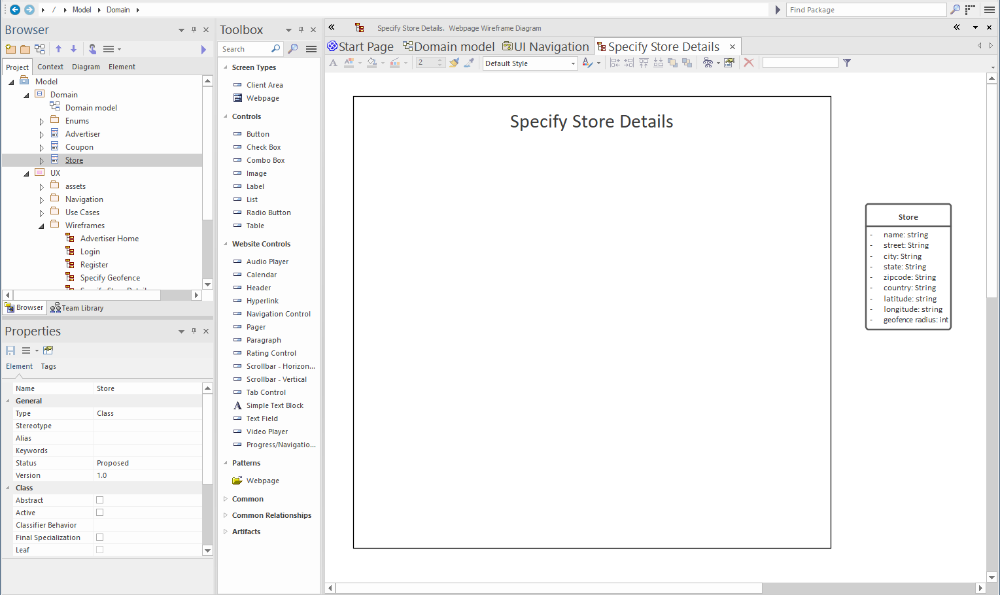
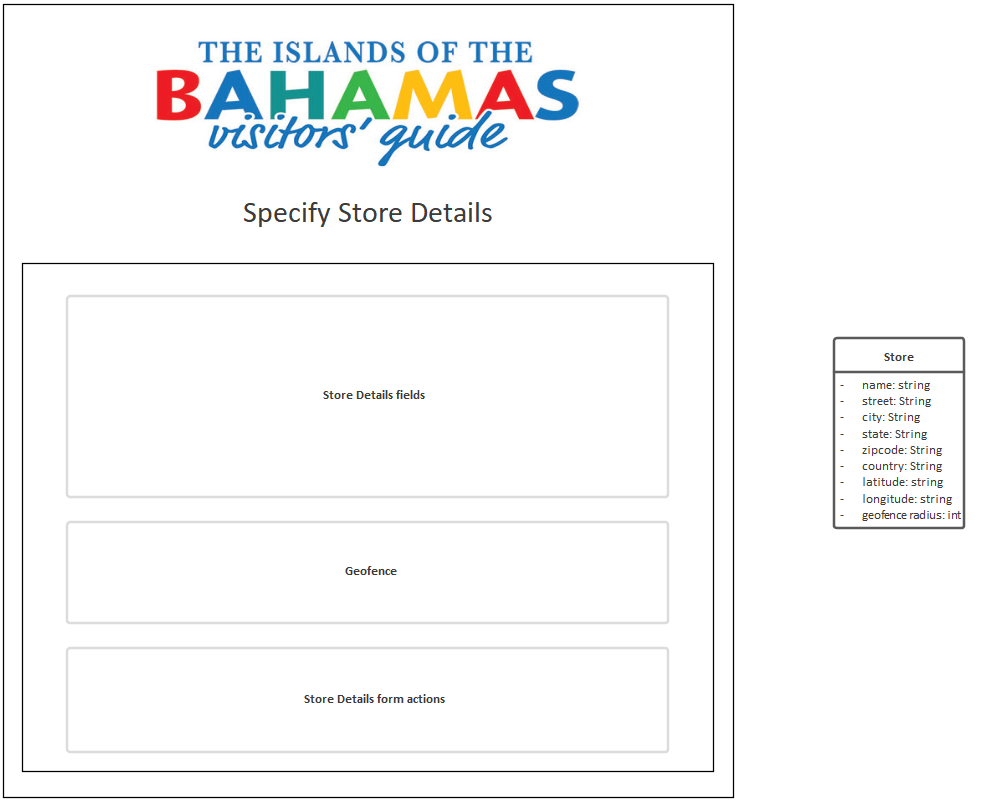
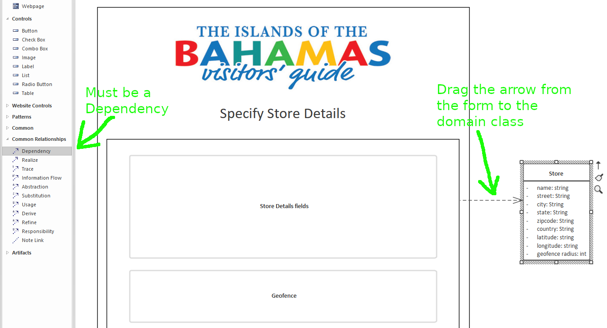
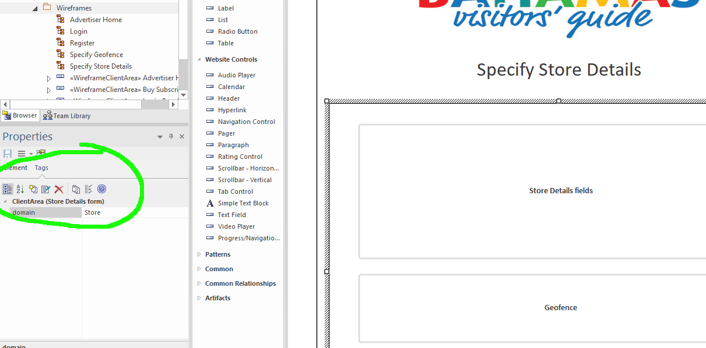
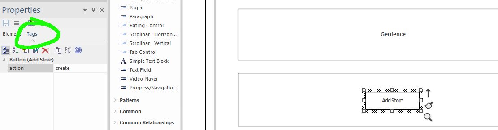
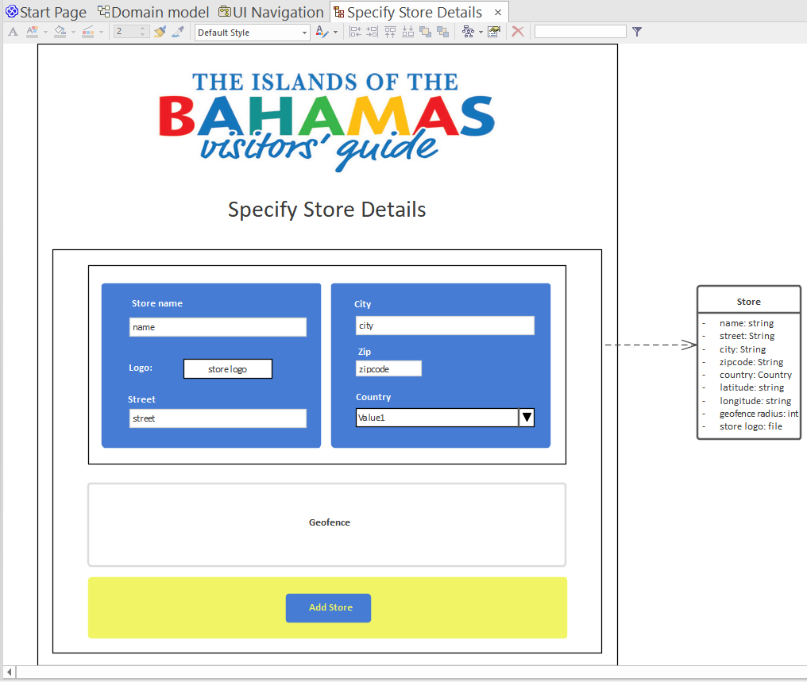

# Input Data with Forms

Of course, a domain-driven application wouldn't be much use if you couldn't use it to input domain-driven data. So here we'll look at how to create input forms, and link them to a domain class.

If you recall from our initial [3-class domain model](../domain-modeling/class-diagrams), a user ("Advertiser") can add details about their store, from which they will be creating special offer coupons. We also have a [use case](use-cases), `Specify Store Details`... so it follows that we need a page where the Advertiser can create their store.

Let's design that page now...

## Create the wireframe

1. In the `UX/Wireframes` package, create a **Webpage Wireframe** called "Specify Store Details"
2. Add a `Client Area` (container) component which will represent the overall page boundary. Give it a name such as "Specify Store Details page", so that the generated React code will use a better name for it than the default "ClientArea". (Using domain-based component names like this is also useful when you're styling the components with CSS classes)
3. Add a `Label` component for the page title - give it a `css class` tag with the value `h1`, and a font size of 18
4. From the `Domain` package, drag the `Store` domain class directly onto the wireframe

You might be surprised by that last one... but it's actually rather handy to have the domain class there on the wireframe to refer to. In a moment we'll also use it as a way to link the form to a domain class.

Here's how the wireframe should look so far:

## Define the page layout

Within the "page" container, we can add some more containers to define the overall page layout:

1. Add a `Client Area` to hold the input form, and call it "Store Details form"
2. Inside this form container, add three more `Client Area` containers: "Store Details fields", "Geofence" and "Store Details form actions"

At this stage you might also want to add the site logo at the top. We already [imported the logo](images) into the model as an image asset - it should be in the `UX/assets` package - so this can be reused:

1. Add an `Image` component to the page
2. Right-click the new component, choose `Appearance > Select an image asset`, and choose the logo

## Connect the form container to the domain class

This is where we tell CodeBot that this form is for doing something with `Store`s. (We'll define what that something is in a moment, by adding an **action**).

In the Toolbox, find the Dependency relationship (under Common Relationships), and drag an arrow from the `Store details form` container to the `Store` domain class:

In other words, we're saying that this input form is **dependent** on the `Store` definition.

> It's important that the container which is connected to the domain class contains all the input components (text fields, checkboxes etc) and the submit button. This is how CodeBot understands the form "boundary" within the page DOM, and also allows more than one form to be present on the same page.

## Alternative way of connecting the form to the domain class

If you don't want to have the domain class on the wireframe, you can also connect the form using a tagged value, as follows:

1. Select the form container in the wireframe
2. In the Properties window, click the Tags tab
3. Add a new tag called "domain", with the value "Store" (or whatever your domain class is named)

> The "dependency" approach we previously described is actually a sort of pictorial shorthand (programmers might call it "syntactic sugar"); behind the scenes, CodeBot converts the dependency arrow to a tagged value. However, we do recommend using the "dependency" approach as it's easier and more visual. It feels less like you're programming and more like you're designing!

## Define a 'submit' action for the form

This is where you'll tell CodeBot that this form is for **creating** a new `Store` record in the database. You do this by adding a tagged value to the 'submit' button.

Talking of which, we don't yet have a 'submit' button the page, so let's add that, and define its action:

and indicate that when clicked, it triggers a "create" action:

1. Add a `Button` component, making sure it's inside the form container
2. Call the button "Add Store"
3. In the Properties window, click over to Tags. Add a tagged value called "action", with the value "create"

> EA uses the button name as its display label. If you want to assign a different name but keep the label, you can also add a tagged value called "text", containing the label text. The wireframe will still show the name, but it'll be generated with the text instead.

It's worth noting, if your button happens to be called "Create", you don't have to add the `action` tag - CodeBot will get the hint that it's a `create` action.

## Add the form components

Now that we have a form container and a 'submit' button, it seems like a good time to populate the form with actual input fields.

We've also done a little bit of housekeeping on the wireframe, and added some [styling](stylesheets).

Each input component (text fields etc) has been given the same name as a `Store` attribute. This enables CodeBot to match up each component with a domain attribute.

> The text field names are displayed on the wireframe; however these won't show up in the generated page. If you want to display a placeholder when the text field is empty, add a tag called "placeholder", with the value being the placeholder text.

If you want the component name to have a different name from the attribute, you can instead specify the attribute using a tagged value called "domain".

For the `country` attribute, we've used a `ComboBox` component. Because `country` is an [enumeration](../domain-modeling/enumerations), CodeBot will automatically populate the combo selector with the allowed values (UK, USA etc).

> **[> Next: Data-bound UI components](data-bound-components)**
