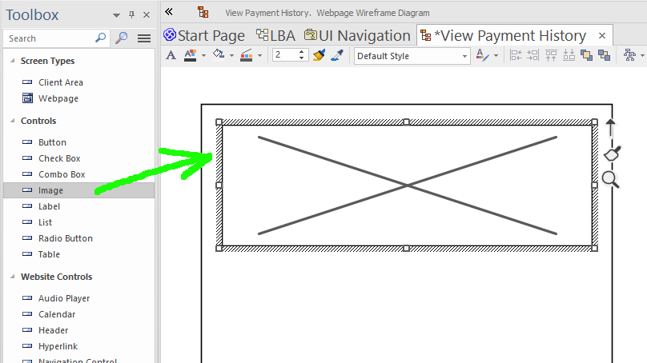

# Images and Other Static Resources

There are two ways to add an image to the generated UI:

1. Embed an `Image Asset` artifact in the model
2. Use the `url` tagged value to reference an image from the web


## Method 1: Embed an `Image Asset` artifact in the model

Static resources (images, CSS files etc) can be packaged in your UML model. CodeBot will extract these from the exported model, and include them in the generated project.

To add an image into your EA wireframe, follow these steps...


### Step 1: Add an `Image Asset` artifact

An [image asset](https://sparxsystems.com/enterprise_architect_user_guide/15.2/modeling/image_assets.html) (AKA artifact) is just a copy of the JPEG or PNG image itself, stored in the model. Once you've added the image asset to the model, you can then add an `Image` component to your wireframe, and assign the image asset to the component.

The easiest way to add an image asset is to drag & drop an image file onto a diagram. Find it in the Project Browser, either by pressing `Alt+G` with the image selected, or by right-clicking the image, and choosing `Find ... In Project Browser`. You can then actually delete it from the diagram, as it's now in the model.

We recommend keeping the image asset *off* any of the wireframes. It isn't actually a UI component (we'll add that next!), it's just the asset itself, and can be reused in different wireframes.

For example, you would import a logo asset once, then reuse the same asset on each page.


### Step 2: Add an image to the wireframe

Drag an Image control onto the wireframe:



Right-click on the image, and choose `Appearance ... Select an image asset`. Then navigate into the package where you've put the new asset, and select it. Resize the image to fit the area you want it to take up:


## Method 2: Use the `url` tagged value

An alternative approach is to drag the Image control onto the wireframe, then add a tag called `url`.

The tag value should be a public URL pointing to the image resource online. The generated app must be able to reach this URL at runtime.

Generally, the first method is more convenient, as you don't have to deploy any images to a separate web server. However, you might opt for the second method if (for example) the image is created dynamically or updated often. (Be mindful of the web server's cache header in the response though).


## Using images with custom CSS

To use an image as part of some CSS styling, e.g. as a tiled background:

1. Include the image somewhere in the model as an `Image Asset` (as above)
2. Use the path to the image in your CSS style

In the React app, the image will be saved into the `public/resources` subdirectory. So the CSS can refer to the image as if `/resources` is the path root, e.g. `/resources/my-tiled-image.png`:

```css
body {
 background-image: url("/resources/my-tiled-image.png");
 background-repeat: repeat;
}
```

Talking of CSS styling, we'll cover that next...

> **[> Next: Style the components](stylesheets)**
