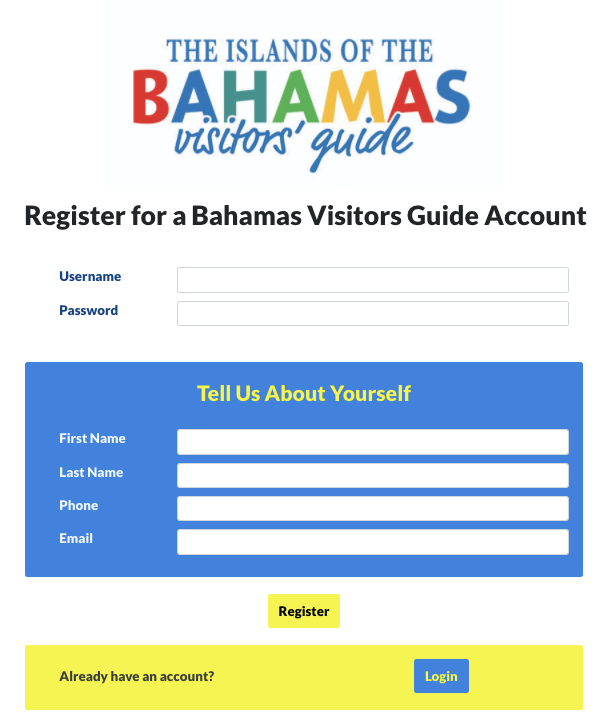

# CodeBot UX

In this section you'll learn how to define the overall user experience (UX) for your generated application, in terms of use cases, site navigation ("user flow"), and wireframes.

Once you've defined the wireframes and navigation diagram, CodeBot automatically translates them into a React web application, REST API middleware server, and back-end database, all fully integrated and working "out of the box" (or zipfile, in this case), with no coding required.

The above screenshot shows a page design for a test project branded using the Location Based Advertising (LBA) example, which we'll continue to use in this section.

> **[> Next: Identify the use cases](use-cases)**
