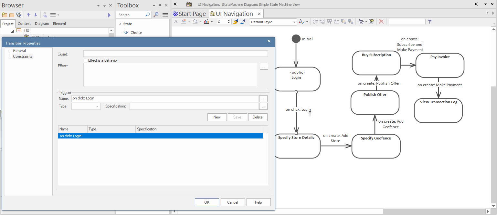

# Defining UI Navigation with State Machines

Having drawn the wireframes for each use case (or at least, having created the wireframe diagrams), you then need to define the user journey, i.e. how users navigate through the website.

You can do this via a straightforward State Machine diagram:

Each state in the diagram represents a single screen/page. In effect, you're defining the available navigation transitions if the current "state" is "user is at this page".

Always define an `Initial` pseudo-state, with one transition arrow pointing from it to the first page/state. This first page then becomes the default landing page, if the site is loaded at the URL "root".

Any transition to a new state occurs when a particular trigger is activated. To set this up, double-click on the transition arrow, and add a new trigger:

The trigger names are based on UI events ("on click"), which in turn are based on specific components in the source wireframe ("Login"). In the above screenshot, "Login" refers to the button name in the page that the transition is coming from.

> **[> Next: Design the wireframes](wireframes)**
