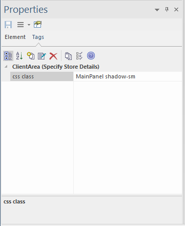
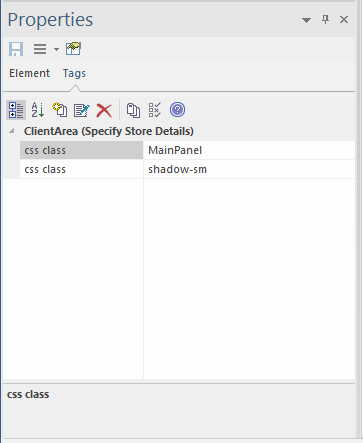
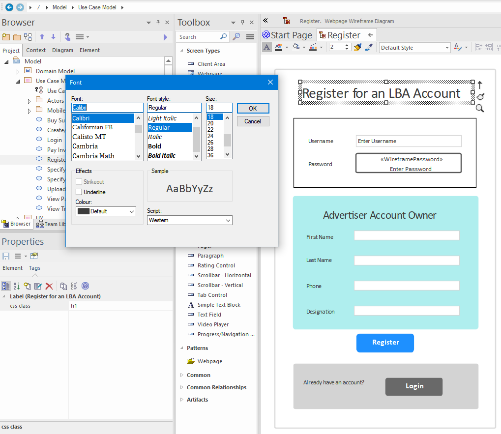
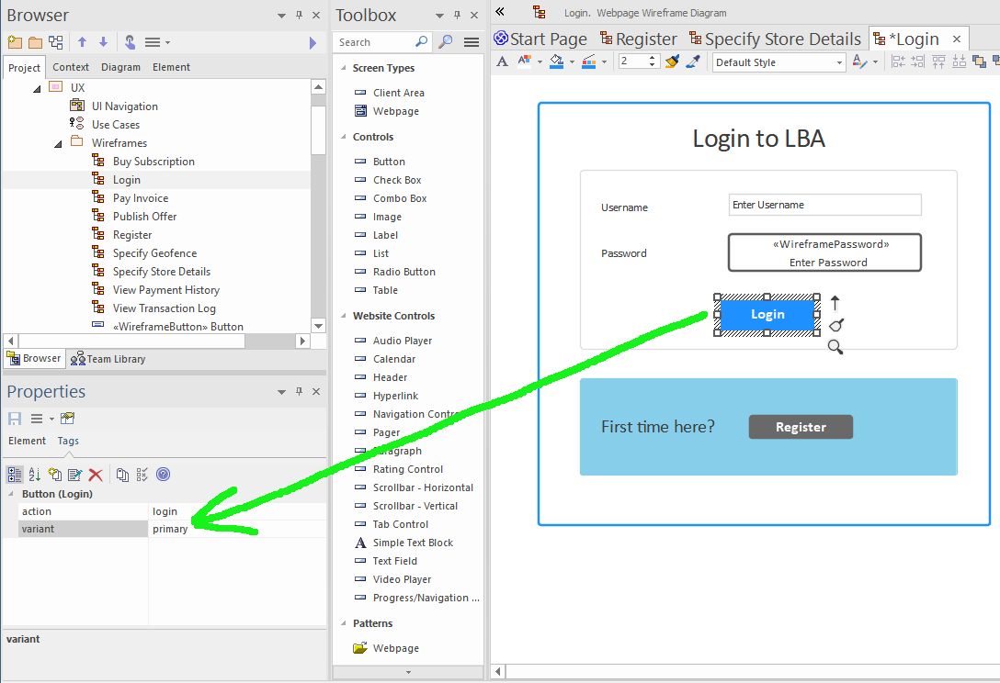
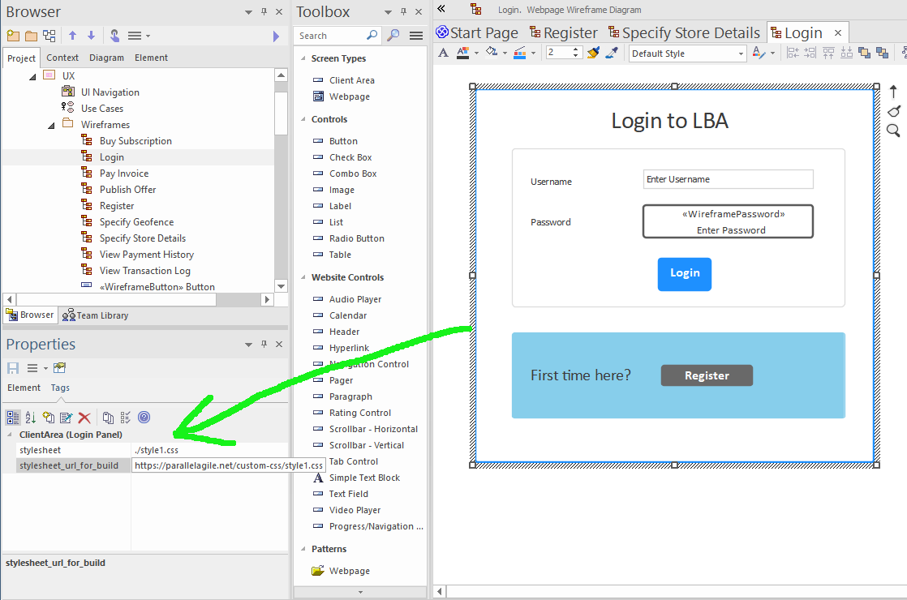

# Styling your application

With any UI, it's important to be able to style it so that, for example, it matches your company's own branding (right down to fonts and font sizes, colours, spacing etc). In this page we explore how you can achieve that with CodeBot UX.

## Use tagged values to specify CSS classes

Each wireframe component can be given tagged values, which CodeBot then interprets when it's generating the code. To specify a CSS class, use a tagged value called `css class`. (It's important to enter this as 2 words, *not* joined together as cssclass or css_class etc).

You can add any number of CSS classes, either separated by spaces like this:

or as separate tags, like this:

## Bootstrap CSS classes

CodeBot generates React.js pages; more specifically, it generates [React Bootstrap](https://react-bootstrap.github.io/). So the components can all be styled using "standard" Bootstrap CSS classes.

Bootstrap includes CSS classes and style variants for headings, buttons, alerts etc; in fact for all component types.

So (as you saw on the previous page) you can turn a label into a heading by 

CodeBot provides some additional styling in a default stylesheet, which you can find in the generated app as `index.css`.

**When we add support for additional target platforms such as Flutter (for desktop/mobile apps), we'll include an automatic mapping from the Bootstrap class and variant names to the target platform styles, so the wireframes shouldn't need to be modified at all.**

## Defining headings

You can define headings and subheadings in 2 ways: as a CSS class, or simply by defining the font size. (We recommend that you define the font size even if you define a CSS heading class, so that the wireframe resembles the generated page as closely as possible).

Heading components are no different from other text labels; they're just styled differently. So to create a heading:

1. Drag a Label component onto the wireframe
2. On the Properties panel, switch to the Tags tab, and enter a tagged value called `css class`, with any of these values, `h1`, `h2`, `h3`, `h4`, `h5`, `h6`
3. Make the font size big enough to look like a heading, or sub-heading. We recommend size 18 for `h1` headings, and 14 for `h2`.

The following screenshot shows all of these styling elements:

To access the label font, click the **A** icon on the toolbar above the wireframe. And to enter the tagged value, find the Tags tab on the Properties panel. This is on the right in EA's default layout.

## Style variants

Bootstrap defines a standard set of style variants - `primary`, `secondary`, `success` etc, which CodeBot also supports. You can apply these to any component, such as a button or panel, using the `variant` tagged value:

If a variant tag is applied to a `Client Area`/`Panel`, CodeBot will generate it as a React "alert" panel.

The [eight variants](https://react-bootstrap.github.io/components/alerts) are:

* primary
* secondary
* success
* danger
* warning
* info
* light
* dark

Using these variants allows your UI to adhere to Bootstrap's recognised design language - if a button is the "main" action on the form ("Ok" or "Submit"), use `primary`; show secondary actions ("Cancel" or "Back") as `secondary`; show success alerts as `success`, etc.

## Using custom styles

It's possible to include custom stylesheets in your wireframes. You can either put all your styles in a single "global" CSS file that will be shared by all the generated pages; or define a separate stylesheet for each page. Or use a combination of the two, with a global stylesheet containing shared styles, and specific styles local to an individual page.

To include a custom stylesheet, you need to place the CSS file somewhere that CodeBot will be able to download it from. You then specify the stylesheet URL using a tagged value called `stylesheet_url_for_build`. Place this on the "outer" panel of the wireframe:

Notice there's also a tagged value called `stylesheet`. This is also important, as it specifies the filename, prefixed with a `./` so that the React build can find it. (In a future update this second tagged value won't be needed).

The stylesheet URL in the above screenshot is: `https://parallelagile.net/custom-css/style1.css`. It applies some light additional styling to each page, to illustrate how the generated page styles can be customised.

The above 2 tagged values only need to be specified once in the whole application, i.e. to be used globally, the tags only have to appear on one wireframe. The CSS styles are then available in every page.

> **[> Next: Join the dots](navigation)**
