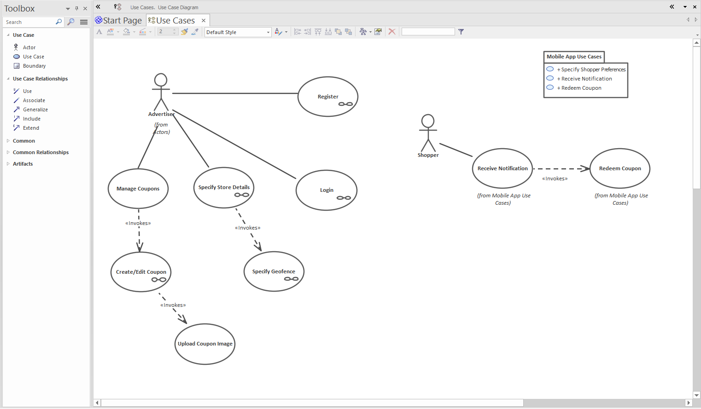
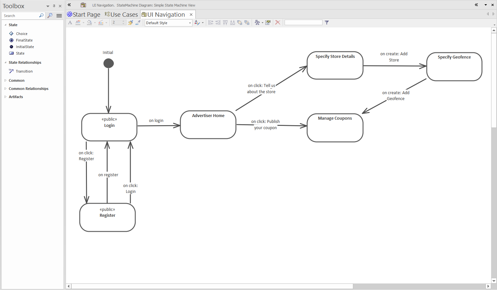

# Use Cases

Use cases are fundamentally about User Experience (UX) - you use them to define the goals an end-user wants to achieve via the UI. In each use case, you then drill down into the steps a user would walk through in order to achieve each goal, i.e. the user flow. In that sense, use cases are very much aligned with UI storyboarding (use case analysis and storyboarding in fact work very well together).

> We can recommend [this book](https://www.amazon.com/Use-Case-Driven-Object-Modeling/dp/1430243058) (written by the co-founders of Parallel Agile) if you're interested to explore this topic more :)

Another way to describe use cases is that they define the system behaviour, from the perspective of an end-user.

Here the **Bahamas Visitors Guide** project's use cases are defined using Enterprise Architect (EA):

Generally, one use case maps to a particular screen (Login, Register, Pay Invoice etc). Each screen is defined as a wireframe diagram; the easiest way to organise the wireframes is to create each one as a child diagram beneath the relevant use case.

To create a child diagram in EA, right-click on the use case and choose `New Child Diagram`. To keep the project structure intact, be sure to place the child diagram in a separate package called "Wireframes". This will keep the Use Cases package from becoming cluttered with UI elements and other unrelated "stuff".

The wireframes can also be accessed via the project browser, but creating them as sub-diagrams allows you to double-click on a use case to navigate directly to its associated wireframe.

# Drive the site-wide navigation from the use cases

We'll cover navigation in more detail later in this tutorial. But it's worth a quick overview here, so you get an idea of how the pages are hooked up.

With CodeBot, the overall site-wide navigation is defined using a state machine - the idea being that the user is always on one page (has reached one "state") at a time. The user then "transitions" to the next page, or state, the transition being triggered by an action in the page - e.g. logging in, clicking a link, or submitting a form.

Once you've identified your use cases, you can start to create the navigation state machine; e.g:

As each state on the diagram represents one page/screen, it's important that each state has exactly the same name as its corresponding wireframe. If the names are different, CodeBot won't be able to match them up.

> Of course, if you'd prefer to start with just one wireframe and try it out, that also works. Sometimes it's good to just get something generated and see a result!

> **[> Next: Drive the site-wide navigation from the use cases](navigation)**
