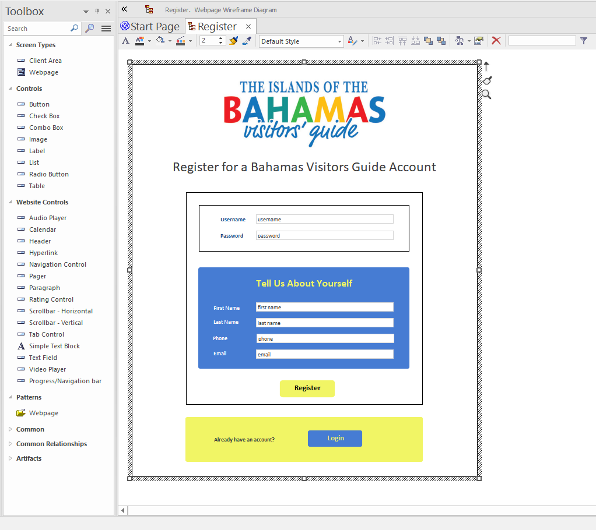

# Web Security

## Create a sign-up page

## Create a login page

...

--

> It's also possible to restrict user access by defining roles, and allocating one or more roles to each user - in other words, **Role Based Access Control** (RBAC). This feature is still in development, but an early version is available in Early Access... if you're interested to try it out, please [let us know](mailto:support@parallelagile.com).

--

That concludes the UX and User Interface modeling tutorial... You should now have everything you need to quickly create a complex full-stack application with a React UI connected to a REST API and database.

There's plenty more that CodeBot is capable of, though. When you're ready, feel free to dive into advanced topics such as custom event handlers...

> **[> Next: Advanced topics](../advanced/)**
