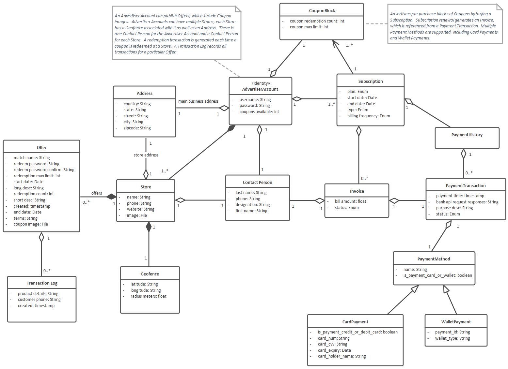

# Domain Modeling

## Draw the domain model as a UML class diagram

CodeBot handles complex class diagrams including the full set of class relationships (aggregation, composition, associations, dependencies, inheritance) and multiplicity between classes.

Our example project contains various domain classes, all of them linked together with various relationships with multiplicity specified between them and serves to illustrate the basic functions of code generation.

Here's the complete domain model diagram (right-click and choose View Image to see it at full size):

## Attributes

Let's "zoom in" to the LBA domain model, to look at the Store class:

The attributes are:

* `image` of type `File` (which hints CodeBot to generate appropriate File Upload/Download API endpoints for this attribute)
* `name` of type `String`
* `phone` of type `String`
* `website` of type `String`

Other attribute types include: int, date, timestamp, time. The Reference section includes a [full list of attribute types](/CodeBot/codebot-reference/attribute-types) that CodeBot recognises, and the respective types they're each mapped to in the target platforms (languages, databases etc).

The attribute types are generic and not tied to any particular language. CodeBot is intelligent enough to convert generic attribute types to language-specific types. For example: attribute with type “String” gets converted to “varchar” type for relational database schema and the same attribute gets converted to “String” type for the Java client.

## Relationships between domain classes

The above domain model diagram shows different types of relationships - e.g:

* Aggregation relationship between `PaymentHistory` and `PaymentTransaction` which tells us that a single instance of `PaymentHistory` has 0 or more `PaymentTransactions` within them
* Association relationship between `Subscription` and `CouponBlock` which implies that a single `Subscription` has 1 or more `CouponBlock` associated with it. Association creates PK FK relationship in the DB schema between the 2 entities
* Inheritance/Generalization relationship between `PaymentMethod`, `WalletPayment` and `CardPayment` where `PaymentMethod` is the superclass (its attributes and operations) being inherited by subclasses: `WalletPayment` and `CardPayment`

## Multiplicity

Specifying the multiplicity of class relationships allows you to pin down the details in your domain model. Multiplicity can be specified at the source and target ends of each relationship arrow. The target end generally has more of an effect on the generated code, while the source end (while occasionally used) is more useful for documentation purposes.

If you don’t specify the multiplicity, the default is 0..* (zero to many).

Other value ranges may also be used such as 1..4. This would be interpreted in most cases as "one to many", but may also be put to use for data validation.

If you’re interested in the specifics, the Reference section includes a [full list of relationship types](/CodeBot/codebot-reference/relationship-types) recognised by CodeBot, along with how they're represented in the generated system.
