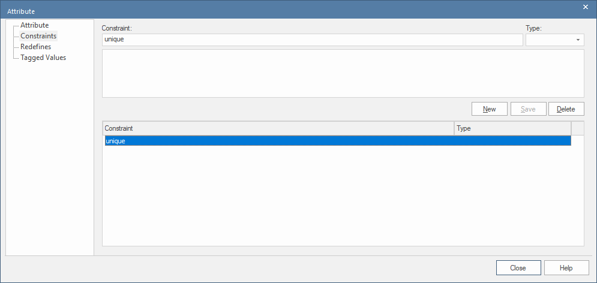

# Domain Model Attributes

Let's "zoom in" to the LBA domain model, to look at the Store class:

The attributes are:

* `image` of type `File` (which tells CodeBot to generate appropriate File Upload/Download API endpoints for this attribute)
* `name` of type `String`
* `phone` of type `String`
* `website` of type `String`

Other attribute types include: int, date, timestamp, time. The Reference section includes a [full list of attribute types](/CodeBot/codebot-reference/attribute-types) that CodeBot recognises, and the respective types they're each mapped to in the target platforms (languages, databases etc).

The attribute types are generic and not tied to any particular language. CodeBot will convert generic attribute types to language-specific types. For example: attribute with type “String” gets converted to “varchar” type for relational database schema and the same attribute gets converted to “String” type for the Java client.

## Binary file attributes

As mentioned above, the `image` attribute is of type `file`. If you need to define a "binary large object" (BLOB) or simply as a media file of some sort, consider using the file uploads mechanism. This allows you to define an attribute type as a file, and provides you with upload & retrieval API endpoints.

## ID attributes

When turned into a database table/collection, each domain class is automatically given an `id` attribute - essentially, a primary key (PK). So you never need to add an ID attribute - in fact it's preferable not to, as this then keeps the domain modeling at a more conceptual, business modeling sort of level.

## Unique constraints

In any data system, some attributes - such as phone numbers and email addresses - must be unique. With CodeBot, the primary mechanism for this is database indexes with unique constraints.

To define a unique constraint in EA:

1. On the domain class, double-click to edit the attribute
2. Select *Constraints* on the left
3. Add a new constraint called "unique", and click *Save*:

ID attributes (mentioned above) are automatically allocated a unique index, as are usernames (which we cover later in the [security/authentication](../security/jwt)) tutorial.

> **[> Next: Enumerations](enumerations)**
