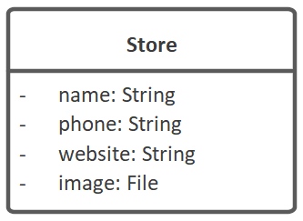

# Domain Model Attributes

Let's "zoom in" to the LBA domain model, to look at the Store class:

The attributes are:

* `image` of type `File` (which hints CodeBot to generate appropriate File Upload/Download API endpoints for this attribute)
* `name` of type `String`
* `phone` of type `String`
* `website` of type `String`

Other attribute types include: int, date, timestamp, time. The Reference section includes a [full list of attribute types](/CodeBot/codebot-reference/attribute-types) that CodeBot recognises, and the respective types they're each mapped to in the target platforms (languages, databases etc).

The attribute types are generic and not tied to any particular language. CodeBot is intelligent enough to convert generic attribute types to language-specific types. For example: attribute with type “String” gets converted to “varchar” type for relational database schema and the same attribute gets converted to “String” type for the Java client.

> **[> Next: Connect the domain classes using UML relationships](relationships)**
