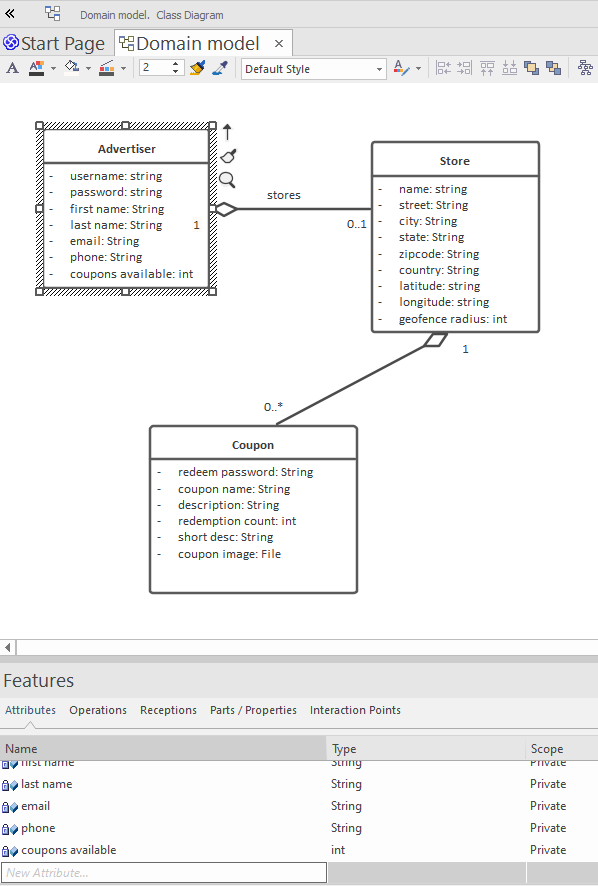

# Domain Model Class Diagrams

CodeBot reads domain models from UML class diagrams. We recommend using Enterprise Architect from Sparx Systems to create and maintain the diagrams.

The diagrams can be quite complex; CodeBot will read the details it needs to generate the code, tests, documentation etc.

Our example **Bahamas Visitors Guide** project contains various domain classes, linked together with various relationships - aggregation, composition, association, inheritance etc. 

Here's an exmaple of how the domain model can end up, after one or more modeling workshops, and in-depth exploration of the business domain (right-click and choose View Image to see it at full size):

However, for the purposes of this tutorial we'll start over with a much simpler diagram, and build on that:

Here, an Advertiser (the web-app's "user") can create a Store, and in turn can define coupons that belong to the store. Each coupon represents a special offer of some sort ("10% off sunhats if you show this coupon!" etc).

There will also be a separate mobile app, for store customers ("buyers"). The idea is that if a buyer wanders within a certain radius of the store's location (the geofence), an alert will ping on their phone, with details of a special offer coupon available a the store.

(In this tutorial we'll only explore the Advertisers' web-app).

> Notice that the `country` attribute is currently a `String` type. We'll shortly change this to a more precise [enumeration](enumerations) of available countries... one of the benefits of being able to incrementally evolve the domain model!

> **[> Next: Define attributes for each domain class](attributes)**
