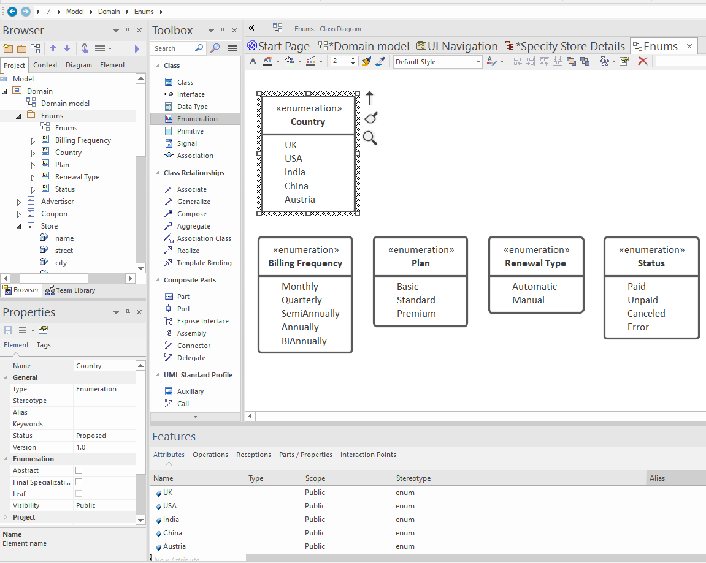
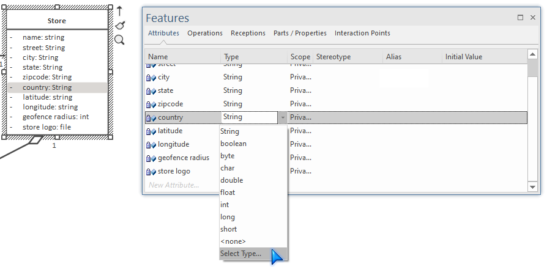
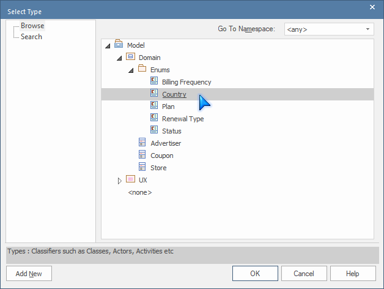

# Enumerations

Enumerations (AKA enums, enumerated types) are an important way of defining a limited set of allowed values for a particular attribute. Think of an enumeration as being a custom data type.

For example, the `Store` domain class has a `country` field. This could be "free text" (i.e. a user could input any value they want there). However, you might want it to be a precise country code, or limit the website's operations to a specific set of countries. In this case, an enumeration is ideal for the job.

We recommend organising enumerations into their own sub-package under Domain:

To create an enumeration, use EA's `Enumeration` type which can be found in the Toolbox (see the above screenshot).

To define an attribute's data type as a particular enum:

1. In the Features window, find the attribute and click its Type selector
2. In the drop-down, choose `Select Type...`
3. Find the enumeration in the `Domain > Enums` package:

> You can also specify the enumeration simply by typing "Country" into the attribute type. However, this is less precise, as CodeBot then needs to match things up by comparing the text. This is probably fine for quick prototyping, but generally it's preferable to point precisely to the right enum.

CodeBot handles Enumerations in various ways depending on what it's generating. For Java and TypeScript, for example, it creates actual Enum types. For MongoDB it simply defines the enum as a string type; however it also generates a JSON Schema "enum" which is used for data validation, so values not in the enumeration are rejected by the API.

> **[> Next: Connect the domain classes using UML relationships](relationships)**
