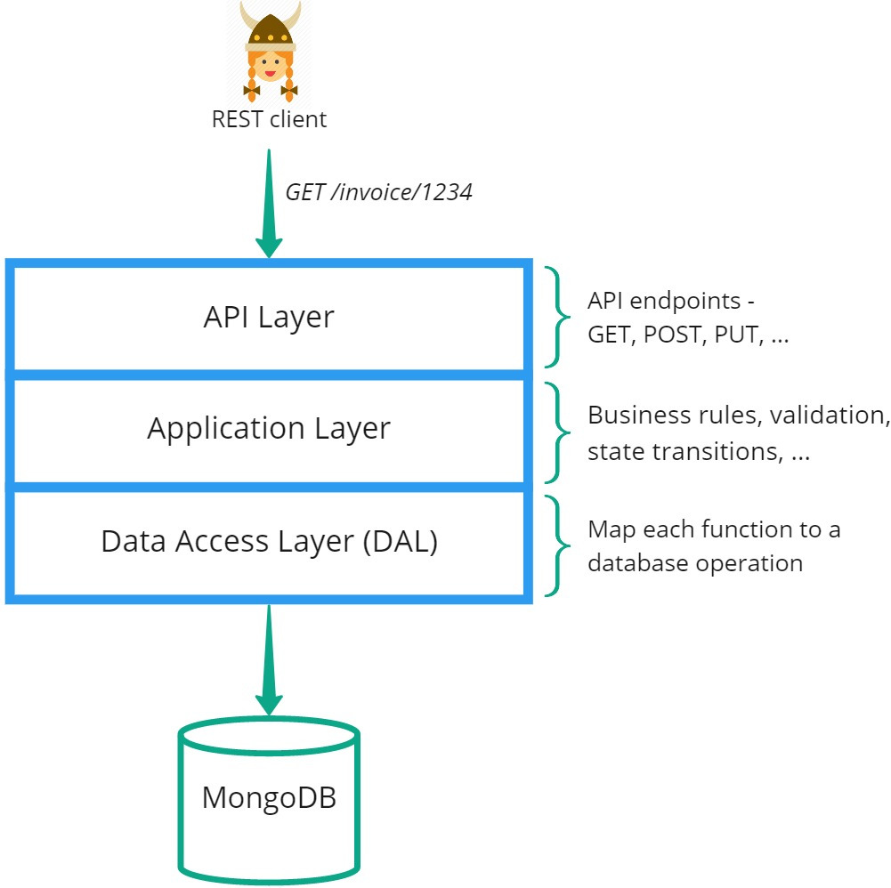

# What Gets Generated?

CodeBot creates a zipfile containing the entire generated architecture. At the time of writing, it consists of the following packages:

Client-side:
1. Domain classes (Java "POJOs" etc)
2. API client libraries, to call the REST API using a variety of programming languages
3. Redux client-side state-management library
4. React web-app

> The React suite (and part of the Redux suite) are only created if your model includes UI wireframes, which we cover in the next section.

Server-side:
1. JSON Schema files
2. Swagger/OpenAPI documentation
3. Application code - business logic, state transitions etc
4. Server-side REST API which connects to a MongoDB database

Each package has its own `README.md` file with setup instructions. Additionally, while designed for reuse, the packages form a dependency hierarchy. So e.g. the domain classes are the "core" building blocks; the API client libraries use the domain classes; the Redux state management library uses the TypeScript client library; the React web-app uses the Redux client library.

On the server, the OpenAPI docs build on the JSON Schema files; the REST API uses the JSON Schema for data validation, and "serves up" the OpenAPI documentation via a server endpoint. And the REST API uses the Application code.

## REST API

The generated REST API is structured as follows:

### API layer

The API layer consists of:

1. The API server endpoints (`GET /invoice/1234` etc) where each domain class has its own Node module and set of endpoints
2. Security access layer - authentication and authorisation
3. Basic data validation for incoming data - based on the JSON Schema files, which are generated directly from the domain model

### Application layer

The Application layer consists of:

1. "Task" operations, which can be reused by other code in this layer, and which in turn makes use of the Data Access Layer (DAL)
2. Event handlers - custom validation, data transformations and application logic, which you can define in the model as domain-driven JavaScript functions
3. Generated state-machine logic (on its way!)

The design goal behind the Application layer is to provide a space where the domain model (both data and behaviour) exists as "pure" business rules, independent of architecture or design details such as whether it's part of a REST API or writing to a NoSQL database.

To this end, you can enrich each domain class with custom Operations (methods/functions), written in simple JavaScript, which just focus on the domain behaviour.

The Application code can, of course, make requests to read and write data, but the actual data access is abstracted into a separate layer.

### Data Access Layer (DAL)

The DAL maps each data access request to one or more database operations. It consists of Data Access Object (DAO) Node modules, one for each domain class; i.e. there's a natural pairing between each API-level domain module and its DAO equivalent. As you would expect, the API layer "knows nothing" about the DAL implementation - just the interface that the API layer calls.

As you'll see later in this guide, the DAL is designed to be replaceable, so e.g. it could be replaced with a different set of DAOs that connect to Oracle instead of MongoDB. Individual DAOs can also be swapped out for a "delegate" that doesn't connect directly to a database at all, but maps and forwards each operation to a separate, third-party REST API or microservice.

> **[> Next: CodeBot UX - draw wireframes and generate a React web-app](../UX/)**
