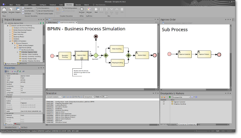

# Enterprise Architect and the Parallel Agile Add-In

We'll use Enterprise Architect (EA) throughout this tutorial. EA also happens to be the best UML modeling tool available. It's been around for years, has a wide user base and active community, and still sees regular new releases and updates.

## Download and install Sparx EA

Download the [free 30-day trial](https://sparxsystems.com/products/ea/trial/request.html) from Sparx Systems...

## Download and install the Parallel Agile add-in

If you install our add-in for Enterprise Architect, you can use it to generate applications directly from your UML model. It's also possible to export the model from EA and upload it to the [CodeBot Web Console](web-console), but running CodeBot from the add-in is more convenient.

[Download the add-in](https://parallelagile.net/EA)

Please note, both EA and the add-in are Windows-only applications. EA can be made to run on a Mac or Linux using virtualisation software such as Parallels/WINE, but the PA add-in is steadfastly Windows-only. If you're using a Mac or Linux, you can still export the model and run CodeBot via the web console.

> **[> Next: Set up cloud hosting](hosting)**
