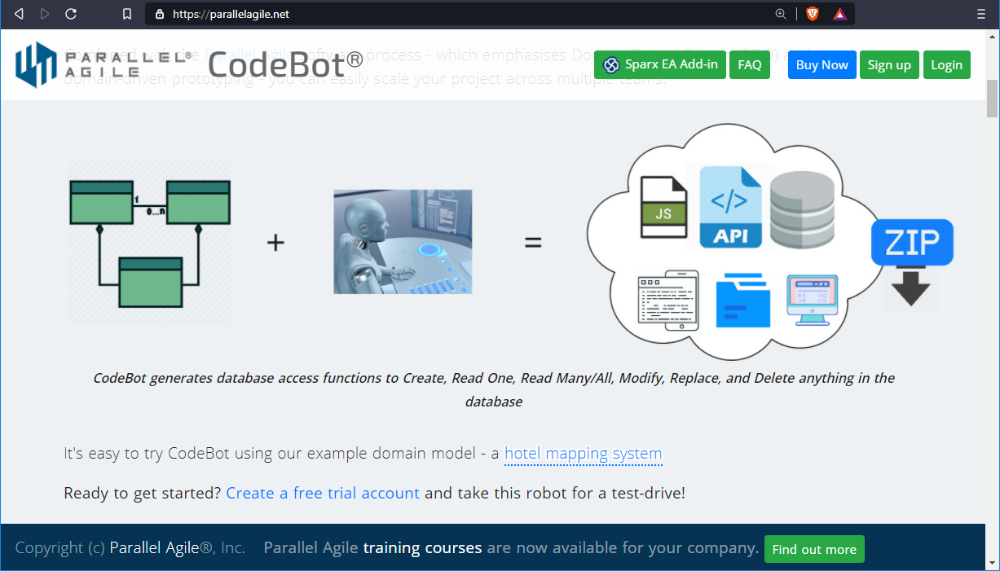
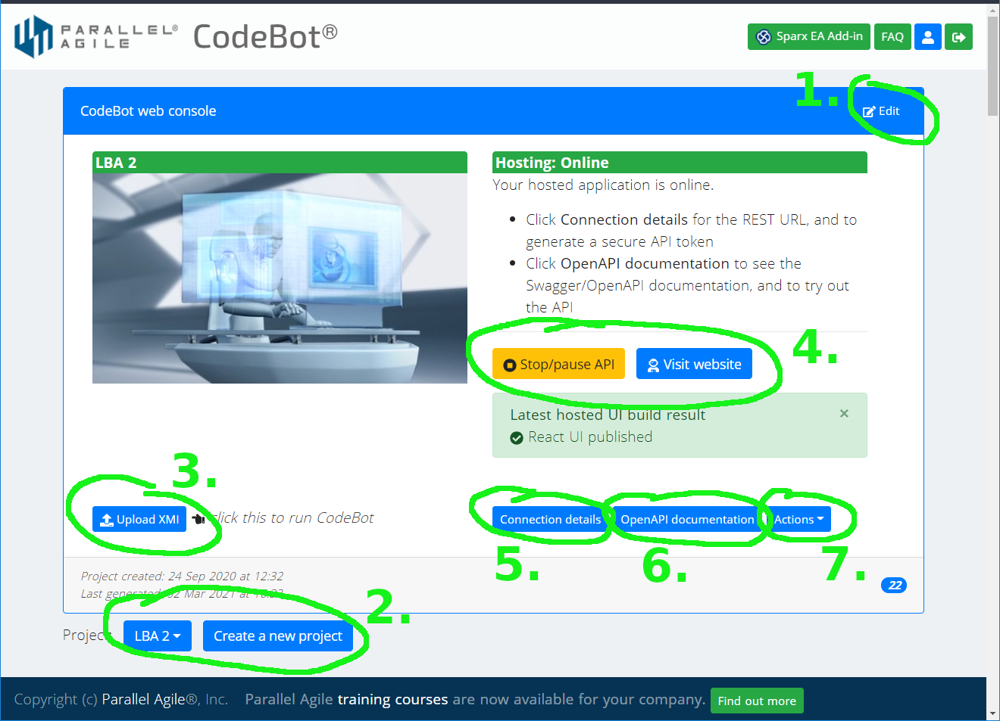
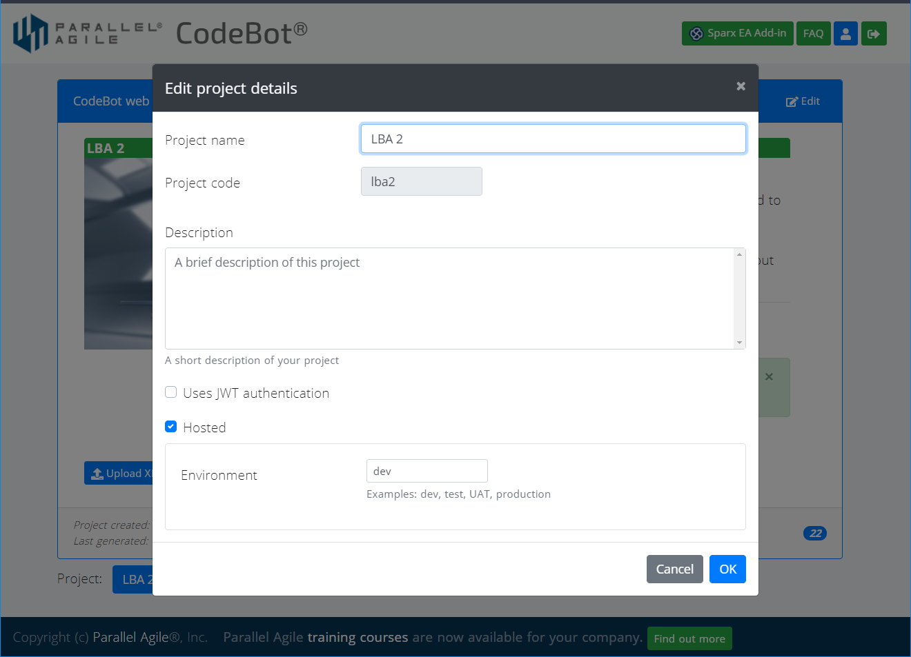

# CodeBot Web Console

The [CodeBot web console](https://parallelagile.net/) is where you can sign up for a Parallel Agile (PA) account, login, and manage the current CodeBot project.

You can try out CodeBot for free, including the [cloud-based hosting](hosting). To sign up, click the `Sign up` button (shown top-right in the above screenshot).

Licensed users can create multiple projects - useful for things like deploying to a separate Dev or Test environment, in addition to a Production environment; or for maintaining multiple cloud-hosted versions of a proof-of-concept app.

## Overview of the Web Console

The numbered items are as follows:

1. Click the `Edit` button to view or edit the currently selected project
2. Use the drop-down to switch to a different project; or click the button to create a new project
3. As an alternative to running CodeBot via the [Enterprise Architect add-in](ea-addin), this option allows you to [run CodeBot](../domain-modeling/generate-api) with an already-exported model file
4. If your project has been generated and deployed to our hosting service, you can start or stop the REST API here, check the latest React UI build progress, or click to visit the generated website. The website is set up to connect with the generated REST API, which in turn connects to a hosted, private MongoDB database.
5. If we're hosting your project, click `Connection details` to find the URL for your REST API, along with a token that must be included in the header of each REST request.
6. Click `OpenAPI documentation` to see the generated Swagger docs for your hosted API. The docs include a `Try it now` button for each API endpoint. This connects to your hosted API, and can be used to add, read, update, or delete the hosted data.
7. The `Actions` drop-down is kind of a "danger zone". From here you can **completely delete** the current project, or erase all of its hosted data.

## Edit project details

Click the button at the top-right of the web console to edit the current project:

Here you can change the `project name`, `description` and other settings.

It's possible to change the `project code` - double-click the textfield to make it editable. This is "subtly discouraged", though, as the project code is used in the generated API REST endpoints; i.e. the URLs will change. The project code is also used in the hosted API and React website; so any affected apps or bookmarks would need to be updated.

The `project name` and `description` are a bit safer to change, though! They're also used in the generated output - they appear in project documentation such as README files and the Swagger/OpenAPI docs.

Further down, there's a checkbox for switching on `JWT authentication`. **This takes effect the next time the project is generated**, i.e. not straightaway. As soon as authentication is activated, the API is effectively locked-down so that only registered users can access it. (These are users of your own generated application, not CodeBot users). Additionally, REST endpoints are now restricted by default, and must be selectively opened up by creating and assigning roles.

Finally, the `Hosted` checkbox defines whether or not the project should be hosted by us the next time CodeBot is run. Again, this setting doesn't take effect straightaway, but instead is used to determine if CodeBot should deploy the new app to our hosting service as the last step during code generation.

> **[> Next: Installing Enterprise Architect and the Parallel Agile EA add-in](ea-addin)**
