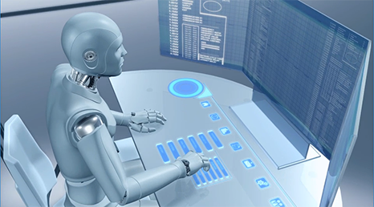
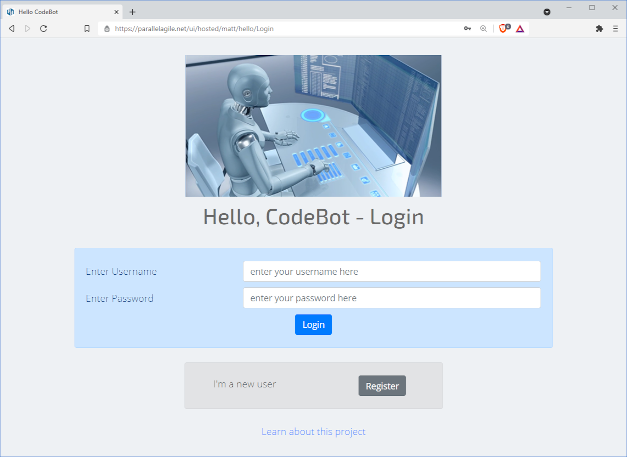
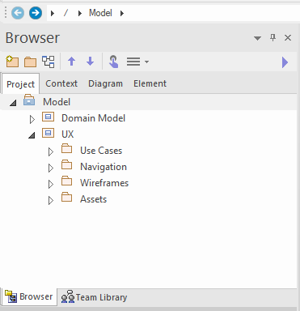
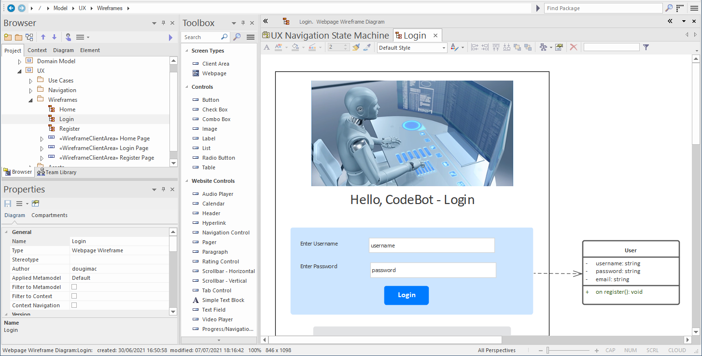
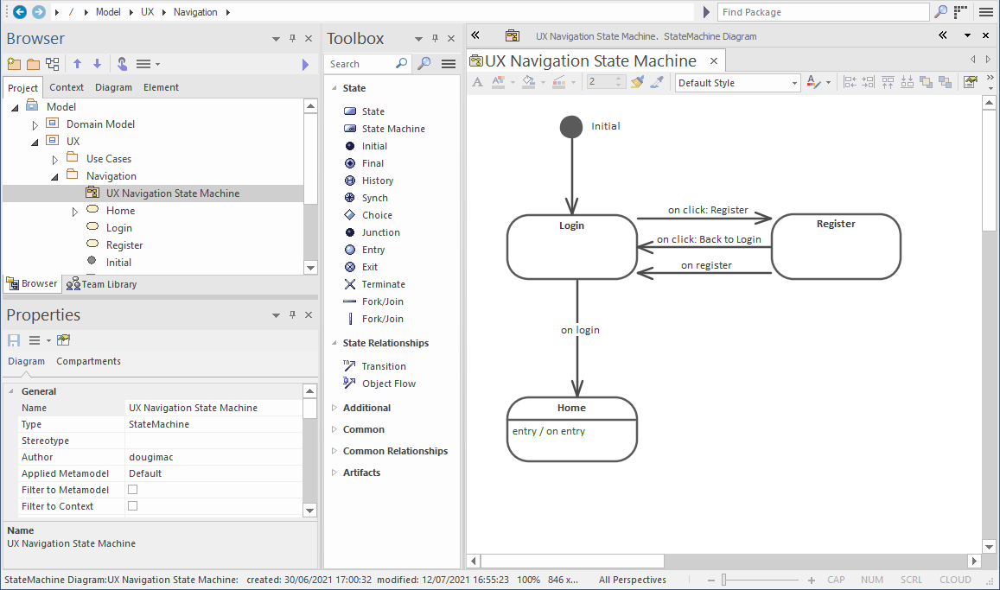

# Example Project - *Hello CodeBot*

*Hello CodeBot* is a straightforward example project which should quickly provide you with a good idea of what CodeBot can do, given even a quite minimal input model.

To try *Hello CodeBot*, you'll first need to have [created an account with us](https://parallelagile.net/) and logged in.

> You can find more ["getting started" details](getting-started/) in this tutorial, though you shouldn't need *everything* described there in order to try out this example.

## If you don't yet have a CodeBot account...

If you just want to see an example of what CodeBot can do, [here's the complete generated zipfile](../images/hello-codebot/hello.zip)... you'll be able to download this to your PC and run the complete software stack locally. (To run it, you'll need Node/NPM, and access to a MongoDB database - check the README.md file in the zip).

Also, *spoiler alert*... here's the React web-app [already generated and online](https://parallelagile.net/ui/hosted/matt/hello/Login) with its own REST API and Mongo database. It was deployed via our "one-click generate model, build and deploy" hosting service. Feel free to register a user, login and watch videos on the "home" page!

But for a quick run-through of how to generate the project for yourself, read on...

## Download the EA Model and/or XMI file

> `>>` Download the [*Hello CodeBot* EA model](../images/hello-codebot/HelloCodeBot-v1.0.0.eapx)

Alternatively, here's [the same model exported](../images/hello-codebot/HelloCodeBot-v1.0.0-EA.xml) as an [XMI](https://www.omg.org/spec/XMI/2.1/PDF) file, which you can run via the [CodeBot web console](https://parallelagile.net/) instead of EA.

> You may need to right-click and "save as..." so that the browser doesn't just display the XML contents.

The model is worth exploring, as - in addition to being a quick "how-to" guide - it also adheres to the recommended CodeBot [UX modeling best practices](../articles/ux_modeling_tips).

## Generate the application

Now that you have the model, you're ready to run CodeBot and try out the generated application. There are two approaches:

1. Run CodeBot via [Enterprise Architect](https://sparxsystems.com/) and our [EA add-in](https://parallelagile.net/EA)
2. ... or, upload the XMI file to the CodeBot web console

In more detail:

### 1. Run CodeBot via Enterprise Architect and our EA add-in

The easiest way to try the project out - assuming you have both Enterprise Architect and our EA add-in installed - is to generate the application directly from the model.

First double-click the "eapx" file to load the project into EA. Have a look at the domain model and wireframes while you're there...

When you're ready, right-click on the root "Model" package in the Package Browser, and choose `Specialize` > `Parallel Agile` > `Generate Project`.

### 2. ... or, upload the XMI file to the CodeBot web console

If you don't have either EA or the add-in installed, you can still generate the whole system via the [CodeBot web console](https://parallelagile.net/), using the already-exported XMI file. (Download link above...)

## Try it out!

Login to the [web console](https://parallelagile.net/) (if you haven't already), and click "Visit website". The hosted React UI will load in a separate tab:

## More about how *Hello CodeBot* works...

During this tutorial you'll learn in quite some detail how CodeBot interprets the domain model and wireframes. But let's dive into a little bit about how *Hello CodeBot* works... As you'll see in a moment, with CodeBot working for you there's very little that needs to be done, in order to turn your EA model into a full-stack web application.

The model can be organised however you prefer; however we tend to recommend the following package layout:

### *Hello CodeBot* Domain model

The Domain Model is a class diagram which (for this example) just contains a couple of domain classes - `User` and `Video`. These define the data schema that will be used consistently throughout all architectural tiers in the application.

### Use Cases

During UX design, [use cases](ux/use-cases) are an excellent way to define goal-based user interaction. They're not essential for a quick demo project like *Hello CodeBot*, but we've included some in the model as a straightforward example of they can be applied to the UX design process.

### Wireframes

Each page (or screen, if you're targeting desktop or mobile apps in addition to web) is drawn in EA's wireframe editor:

[Data-linked](ux/data-linked-components) (i.e. data-aware) components such as forms and listboxes can be linked directly to domain classes - e.g. in the above wireframe, the login form is linked to the `User` domain class. CodeBot pretty much always figures out your intention from that single link.

> The generated system includes a secure REST API which manages data storage and querying via a back-end Mongo database. The UI components and associated state-management code are generated to work "out of the box" with the REST API.

For *Hello CodeBot* we've just defined 3 pages: `Login`, `Register` and `Home`. `Home` is only accessible if you've registered as a `User` and logged in.

### *Hello CodeBot* UI navigation

Once you've drawn each page (or at least defined them and created a placeholder wireframe for each one), you can define the overall site navigation. To do this, create a state machine like the following:

### Assets package

This is where you can store images, stylesheets etc that you want to be packaged-up and included in the application build.

There are other ways to bring in custom files e.g. load CSS or images via external URLs at runtime; however, using the Assets package is a convenient way of keeping everything that defines the project in one place.

> The Assets package name & location are just a recommendation. *Any* files included in the model will be bundled with the built & deployed application. 

## Summing up

Creating a full-stack application using CodeBot really is as straightforward as that! No coding required... although CodeBot doesn't shy away from non-trivial applications requiring complex "business logic" code, either.

To illustrate the potential, we've included a working JavaScript code fragment in the model. This code is injected into the REST API and is triggered to run during certain [server-side events](advanced/server-event-handlers). We'll explore what the code does in a follow-up article.

You can also read this [in-depth exploration of Hello CodeBot](https://medium.com/parallel-agile-blog/tutorial-hello-codebot-a-simple-secure-rich-media-low-code-application-2229a4296ea7).

Please do give *Hello CodeBot* a try. If you encounter any problems getting it running, email us at support@parallelagile.com, and we'll do our best to help out.

Meanwhile, back to the tutorial...

> **[> Next: Back to the web console](getting-started/web-console)**
