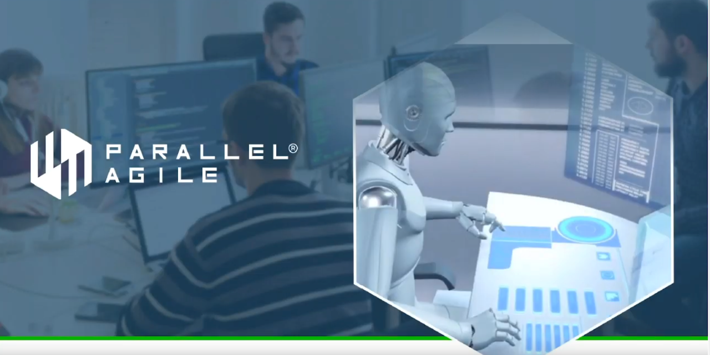

# Process Guide - How to Generate Complete Software Systems with CodeBot

**Welcome to the Parallel Agile CodeBot process guide!**

In this tutorial we'll walk through the steps involved to create a complete, full-stack web application using CodeBot, with little to no coding required. The finished system can either be hosted via our cloud service, or downloaded and hosted on your own servers; or deployed straight into your project's CI pipeline.

The steps involved could be summed up as "Draw a domain model, design some wireframes, hit Generate, and you're done"... This is often sufficient, especially during a project's early prototyping stage where you just want to see quick results, and use early feedback to help drive the requirements.

However, in this guide we'll walk through the steps in plenty of detail to show how to get the best results from CodeBot and produce a finished, production-ready system.

> If you're already familiar with CodeBot and just want the details, head over to the [reference section](../codebot-reference).

Each page in this tutorial finishes with a `>> Next` link, so the whole thing can be read in sequence:

> **[>> Next: Getting Started](getting-started/)**
