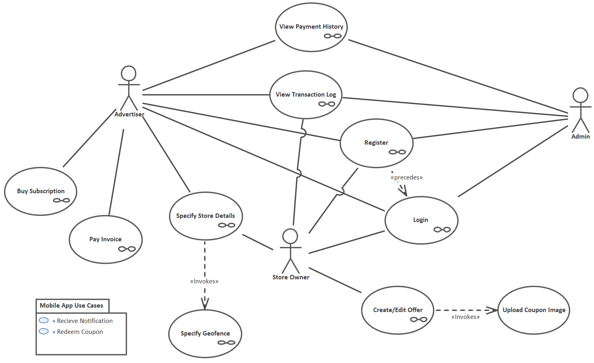
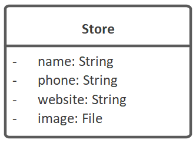

# Example Project - LBA

Throughout this guide, we'll use an example project which we'll gradually build on to create a complete cloud-hosted database, REST API and web application. Later we'll show how to configure web security, so that the app requires registration and login, and access is restricted selectively via role-based access.

We'll start with "baby steps", though, to demonstrate how easy it is to quickly get something up & running with CodeBot.

## LBA

The example project we'll use is a Location Based Advertising (LBA) system. Using LBA, advertisers can publish offers (which contain coupons) to the cloud, and a location-aware mobile app can receive and redeem the coupons.

The idea is that someone with the LBA app on their phone will be alerted of nearby special offers - discount coupons, etc - if they wander within a certain distance of any stores offering the coupons.

The use cases for the LBA website are defined as follows:

Both Advertisers and Store Owners can Specify Store Details and Create/Edit Offers.  Only the Advertiser can Buy Subscriptions and Pay Invoices.  Admin is a <superuser> role that can exercise all use cases of the system.

Here's the Store domain class:

We'll explore the LBA domain model in more detail, straight after getting everything set up.

> **[> Next: Create a domain model](domain-modeling/)**
