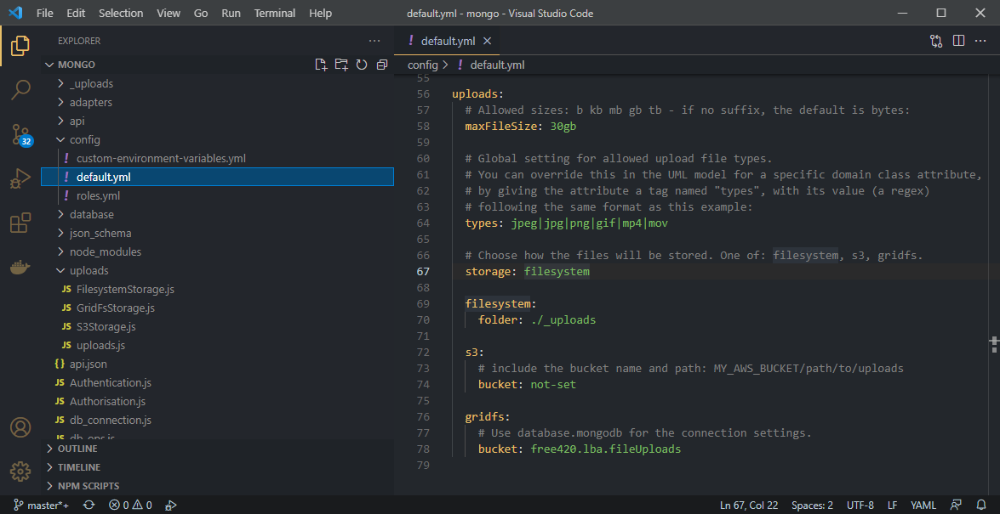

# Binary File Uploads

This feature isn't really a "Low-Code" feature, as it can be achieved quite easily without writing any custom code. However, it has a tendency to be used in conjunction with custom event handlers, particularly for custom processing of the uploaded files - examples include:

* generating image thumbnails from uploaded videos
* emailing images or "new video" notifications
* triggering an image processing pipeline
* virus-checking uploaded zipfiles or executables

... and so on.

## Why binary file uploads?

Many applications have a need to handle uploads of large files in the Gigabytes or Terabytes. It's generally considered bad practice to store these directly in your database (impractical, inefficient, or just too costly). It may also be impossible, if the database has an upper limit on attribute size, or doesn't support Binary Large Objects (BLOBs).

So, in the interest of using the right tool for the right job, you'd normally have a separate file storage repository which can more efficiently store and retrieve files.

Files are uploaded and retrieved via the generated REST API.


## File storage

CodeBot currently supports these storage types:

* Local filesystem
* GridFS (MongoDB's built-in file storage)
* Amazon S3

You specify the storage type by configuring the generated REST API - in your IDE, open `config/default.yml`:



> We recommend changing the settings using environment variables, so that your changes aren't overwritten next time you run CodeBot. See the generated `README.md` for details.

The `storage` setting can be changed to one of: `filesystem`, `gridfs` or `s3`.

> For hosted APIs, we automatically set this to write your files to a private `s3` bucket which only your API can access. Please note that additional costs are involved with hosted file storage and retrieval.

Though `filesystem` storage could feasibly be used in a production system, we wouldn't recommend it - however it's useful for when you're developing and testing the API on your local PC or test server. The files are written to an `_uploads` subdirectory beneath where the API is running.


## Domain driven file uploads

Imagine the case where you want to allow users to upload video files (MPEGs, MOV files etc), and for other users to view them.  Typically you'll also want to store metadata - attributes such as the video title, subtitle and description.

To do this, create a `Video` domain class:


The `movie` attribute has a data type of `file`. This data type tells CodeBot that you want this attribute to be an uploadable file.

Generating file uploads is actually as simple as that - you just need to specify a `file` attribute type! By default, the generated code will allow a range of file types:

```
jpeg|jpg|png|gif|mp4|mov
```

However, you can specify others, or narrow the range down (e.g. allow only images, movie files or zipfiles), using a tagged value called `types` on the attribute. Use the pipe symbol to separate the file types:

```
types:  zip|tar
```

To perform further checks or processing on the uploaded file, use the `on file upload` event handler. For example, this could inspect the contents of the zipfile, and veto the upload if needed.


--

This concludes the CodeBot process guide. Congratulations for reading this far!!

Next, you might like to explore the [CodeBot reference section](../../codebot-reference/), or our guide to the [Parallel Agile development process](../../parallel-agile-process-guide/).
