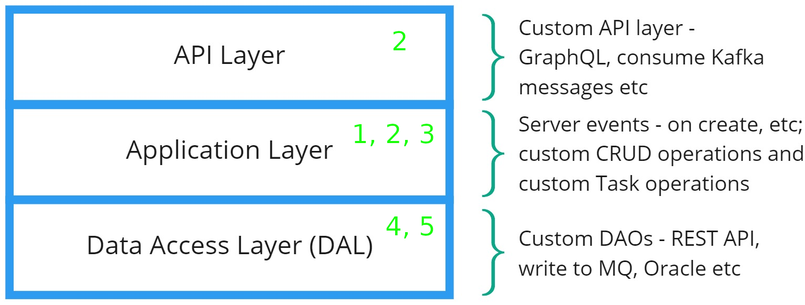
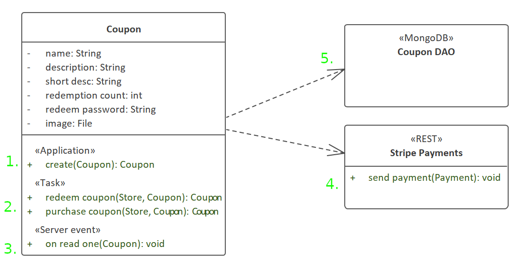

# CodeBot - Low-Code Capabilities

This section explores some of the extensibility that makes CodeBot a truly low-code platform. This includes writing domain-driven code (event handlers etc) to define executable business rules as a core part of the domain model.

The section following this then takes "low-code" a step further and covers [how to integrate with other systems](../system-integration/) - third-party REST APIs, microservices etc.

## Code extension hooks

In the generated application server, custom code can be "injected" into a number of different areas, depending on what you need to do.

Thinking back to the application server "layers" that we covered earlier in the guide, here's what can be customised with code in each layer:

The numbers in the above diagram match up with the following class diagram, to show how you'd go about modeling the custom code in the domain model - don't worry about the details for now, this is just to provide an overview:

The numbered items are as follows:

1. The `Coupon.create` operation entirely replaces the default "create" CRUD operation, which would normally call the MongoDB DAO to create a coupon record.
2. The "task" operations `redeem coupon` and `purchase coupon` are each implemented as both a REST "task endpoint" in the API Layer, and a function in the Application Layer.
3. `on read` is an example of a CRUD [event handler](server-event-handlers). In this case, any time a Coupon is read from the DAL and is about to be returned through the API, the `on read` function is called.
4. On the `Stripe Payments` interface, `send payment` represents an external REST API endpoint in the Stripe payments API. This is called by `Coupon.purchase coupon`.
5. Like `Stripe Payments`, `Coupon DAO` is also a UML Interface. However its `<<MongoDB>>` stereotype means that it's implemented as a Mongo DAO rather than a REST DAO.

> By default, all domain classes have a Mongo DAO generated for them, so normally **you don't need to explicitly add a DAO interface for each class**. However, you *can* still add one if you want to show clearly that the class is connected to a Mongo database, or if you want to customise the Mongo CRUD operations in some way. In this example it's required, because `Coupon` uses a Mongo DAO in addition to the custom REST DAO.

In the rest of this section, we'll explore each of these "extension hooks" in turn.

> **[> Next: Server event handlers](server-event-handlers)**
