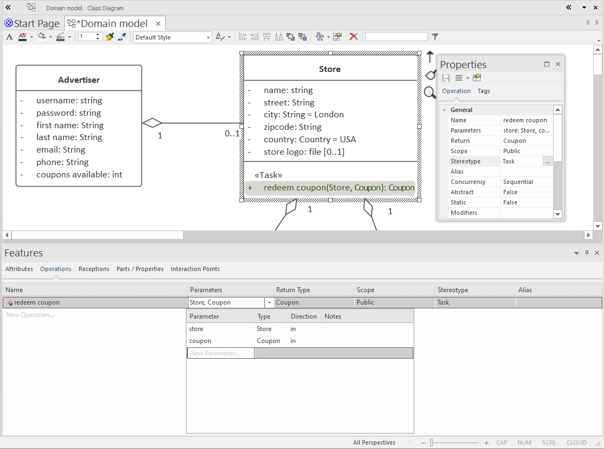
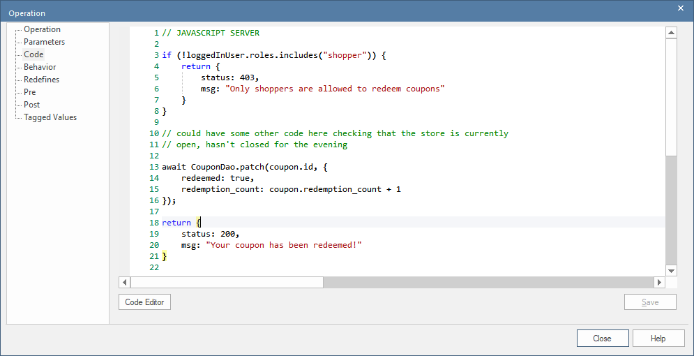

# Task APIs

Up until this point in the tutorial, the APIs being generated have focused on create, read, update and delete (CRUD) functionality. It's a starting point, but it's preferable to base your API on specific tasks (goals, use cases). So instead of using endpoints like "create Invoice" or "modify Invoice", you'd use "send Invoice" and "cancel Invoice".

> More often than not, there's a 1:1 correlation between a task and a use case. So we do recommend first modeling the use cases, then associating each one with the relevant endpoint. This provides a linkage that's in turn useful for identifying and tracing test cases.

CodeBot does generate some task-oriented endpoints automatically - in particular, `login` and `register`. But it's possible to define additional task endpoints, to create an entire REST API that's structured around goals (use case driven) and not simply based on CRUD operations.

This in turn can help with defining a more secure API, as data access and updates can be granted based on specific use cases, and not just fine-grained table/row access.


## Why task-oriented? (Practical reasons)

Taking `register` as an example, in reality it may combine the following CRUD operations:

1. Lookup the username and email to ensure they're not already taken
2. Create the new User record
3. Perhaps (if an `on register` event handler is involved) create a `UserSession` record in the database

Another, more application-specific example could be to book a hotel room on a specific date for 3 nights. Overall this is a single task, but involves several CRUD operations to successfully complete:

1. Lookup the `Hotel` record and check its status (e.g. hotel is currently open and accepting bookings)
2. Lookup the relevant `Room` record, and also check its status
2. Query the `HotelReservation` table to ensure none of the requested dates are already taken for the requested room

Of course, you may also need this sequence to be transactional, which wouldn't be possible if each of the 3 steps is invoked as a separate API request.

## Why task-oriented? ('Good design practice' reasons)

Depending how you're approaching your application design, you may also choose to define a task-oriented endpoint for most aspects of your API. Essentially, this separates "CRUD" implementation details from your client code. The web-app shouldn't need to know that in order to book a hotel room, it must create a `HotelReservation` record. It's an abstraction leakage.

Instead, you could define a task-oriented endpoint called, say, `book hotel room`, which in turn invokes the CRUD operation to create the `HotelReservation` record. This way, the booking process is abstracted away, encapsulated within the server API.

If the booking process changed later on, you would then only have to modify the server-side code in one place, rather than every web client and mobile app that uses the API.

## How to create a REST API task endpoint

Returning to the LBA example, let's say we have a use case called "Redeem Coupon". A user has a coupon on their app, and wants to use it to get 20% off a T-shirt at the relevant beach-side store.

So - assuming the user is logged-in - the task endpoint would need to:

1. Check that the user has the required coupon
2. Check that the coupon is still valid (hasn't expired)
3. Update the coupon to show that it's been used
4. Return an "Ok" indicating that the app can show a "Success!" message

Here's a slightly modified version of the domain model we began the tutorial with:



To define the endpoint:

1. Create an Operation on the domain class that's "closest" in its context to the task at hand. 
> Sometimes this can be a subjective choice, especially if more than one domain class is involved in the task. In the above example, we've added `redeem coupon` to the `Store`, as it seems like the most logical home for the task... in the "real world" if you have a Walmart 20% Off coupon, you head to a nearby Walmart to redeem the coupon.
2. Define the input parameters - in this case, we need the coupon and the store where it'll be redeemed.
3. Define the Return Type. As well as being good documentation, this helps CodeBot to generate client libraries and Swagger docs that map the response correctly.
3. Assign a `<<Task>>` stereotype to the Operation. This is the instruction that tells CodeBot to create a "task" API endpoint.


## Defining the endpoint's HTTP method

The default HTTP method for any task is GET. To override this, specify a `method` tagged value on the Operation, as follows:


## The endpoint path

By default, the endpoint path is derived from the Operation name using `snake_case`, so the URI for this endpoint would be:

```http
/lba/Store/tasks/redeem_coupon/1234?coupon=5678
```

Because we added two parameters to the Operation, the REST path includes the Store ID ("1234"), while the coupon ID is a query parameter ("coupon=5678").

To define that in a more formulaic way, to map out the parameters CodeBot does the following:

1. The first parameter is considered to be the main "REST resource", so it's always added to the path
2. Any additional parameters are considered to be "extra details", so they're query parameters.

Parameters can be any of the usual data types (String, int, boolean); or domain objects. In the latter case, the generated code reads the domain object ID from the path (or query param), and automatically looks-up the matching database record. So when your custom task code is reached, you'll have both the store and coupon objects as function arguments, called (predictably) `store` and `coupon`.

If any domain object parameter isn't found (including query params), the API will respond with a 404.


## Tailoring the endpoint path

As you can see in the previous screenshot, we've tailored the path using the `path` tag. So the URI will actually be:

```http
/lba/Store/UseThatCoupon/1234?coupon=5678
```

> Note the `/tasks` section of the URI has disappeared. The `path` tag overrides this section as well, so be careful to include it in the tagged value if you want to keep the task endpoints separate from the CRUD endpoints.

The `1234` in the path is the Coupon ID. This is there because the Operation has an input parameter, `Coupon`. Note this must be the specific domain class selected from the model, not just the text "Coupon". The parameter's multiplicity is 1, so the generated endpoint will require a coupon ID in its path.

You can add as many input parameters as you like. Each one can be a "primitive" value (string, boolean, number) or a domain object. CodeBot will lookup each required domain-object record via the relevant DAO, before calling the custom Operation. If any of the IDs aren't found, the API will respond with a 404, without having called the Operation.

## Adding the task function

All that's left, then, is to write the server code that fulfills the task. To do this, open up the code editor within the Operation:



> The code in the screenshot first checks that the user belongs to a specific "shopper" role. We've put that in as an example usage; however the same check can be achieved without code, using [RBAC](../security/rbac) configuration.

The Operation should be written as a self-contained block of code (no "function xyz()" declaration or "()=> {...}" arrow function), as the code will be injected into an async function with its own `try...catch` block etc.


### Input parameters

Some local variables will be available to the code:

* the specified Parameters - each param name will, of course, be the parameter name you specify in the model (albeit converted to `snake_case`)
* `loggedInUser` - if it's a secure API and the class or endpoint aren't stereotyped as `<<public>>`, this is the User (the identity class name) that made the API request. All the user attributes are available except for their hashed password.
> If you specified, say, `Account` for the identity class, `loggedInUser` will be `loggedInAccount` instead. 
* `directive` - this is a mostly free-form JavaScript object which may have already been populated by a previous Express middleware function. You can add to the object to send ad-hoc data in the response.

### Return type

Unlike [event handlers](server-event-handlers), the function **must always complete by returning a result**. This can optionally be in a Promise (in fact it's very likely it will be).

For example:


```JavaScript
return ok("All done")
```

For REST APIs, this is turned into a "200 OK" response together with the following JSON object:

```JSON
{
    "message": "All done",
    "directive": {}
}
```

You can also return data,

```JavaScript
return ok({
  message: "All done",
  data: [] // or {}
})
```

`data` contains the data to go in the response body. The value can be anything you like (array, object, unary value, undefined).

Besides `ok()`, other result "creator functions" that can be used are:

created() // returns a 201 response
unauthorised() // returns a 401 response
forbidden() // returns a 403 response
notFound() // returns a 404 response
reject() // returns a 400 response
error() // returns a 500 response


As with the CRUD endpoints, the actual response will look like this:

```JavaScript
{
  message: "(your msg if defined, otherwise a default to match the result type)",
  data: (your data),
  directive: {}
}
```


## Module dependencies

Each domain API is normally paired with a single DAO, e.g. CouponApi will always have CouponDao available. (See the generated code for many examples of how it's imported/required and called). If you need to access other DAOs besides that one, simply `require` them (again, see the generated code for examples).

> Although the `require` can be placed in the task function itself, we recommend instead declaring it in the custom [`_init` function]((../../codebot-reference/server-events)), so that it's declared near the top of the module, and only declared once overall.

## Restricting task APIs using RBAC

The [API security model](../security/) works by granting access to users and roles, so the default state is implicitly *no access*. This is the same for both task and CRUD endpoints.

You can open up access to each task endpoint by [allocating roles](../security/rbac), in much the same way you can with CRUD endpoints.

(More to follow on this subject)...


## Linking a task endpoint to an external (third-party) REST endpoint

Often, your project will require a task endpoint which simply calls through to some other external API. The other API may be a cloud service, or a microservice that's being staged by a different developer or team in the same project.

### If the external endpoint is a CRUD operation...

This one's fairly easy. Define the external REST API as a [DAO Interface](../system-integration/crud-rest-apis). It'll be generated as a DAO module, which you can then call directly from your function using the usual generated DAO methods - just as if it's a database DAO.


### If the external endpoint is a Task operation...

The external API itself may be task-based, in the sense that it doesn't simply store or retrieve a domain object; e.g. it might be a Machine Learning system that detects license plate numbers from a video file.

In this case, you need to define a separate UML Interface to model the external REST API, then use a Dependency arrow to make the domain class "depend on" the interface.

[Find out how to do that here](../system-integration/task-rest-apis)...


> **[> Next: Binary file uploads](binary-file-uploads)**
