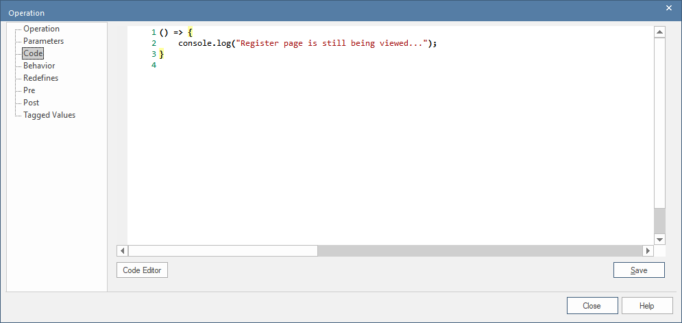

# Custom State Behavior Functions

> **Disambiguation:** In previous lessons we've been talking about state-bound UI components. Unfortunate name clash, but here we're talking about custom behavior that runs when the *UI navigation* enters a particular state (i.e. a new page). The two "state" concepts are completely unrelated...

--

UML state machines have a neat feature whereby you can specify a *behavior* (i.e. an event handler, or function) that executes at one of 3 stages in a state's lifecycle:

1. entry
2. do
3. exit

The `entry` behavior executes when the state machine enters a new state; the `do` behavior executes during the state; and `exit` executes when the state transitions away to some other state.

For UI navigation, you can make use of this by specifying a JavaScript function for any of the behaviors. To do this, click on the `Name / Comment` cell next to the behavior, and type a new function name:

The name can be anything you like, as long as it's a valid JavaScript name, and not already used in the same state/page.

Then double-click the name, and type in the code on the Code tab:

## State entry behavior

In the above example, you should see the message logged in the browser console each time the Register page is viewed.

Note the ES6-style [arrow function](https://developer.mozilla.org/en-US/docs/Web/JavaScript/Reference/Functions/Arrow_functions). Currently there are no arguments passed into the function, but in a future update the domain objects in the current page will be passed in.

## State 'do' behavior

The 'do' function is called once when the page is first rendered, then repeated each time the page is re-rendered, e.g. due to a state change that causes a component in the page to redraw.

## State exit behavior

The 'exit' function is called once whenever the browser navigates away from the relevant page - i.e. when the state is exited.

Note that there's essentially no *guarantee* that the exit code will run; e.g. the user might close the browser, and re-open it with the URL pointing to a different page in the web-app. In this case, the 'exit' code would have been avoided. So it should just be used for non-essential code such as debug logging.

**Note: Be sure to click Save after editing any of the code functions in EA.**

# Behavior functions as React code

For React, the behaviour functions are generated as [effect hooks](https://reactjs.org/docs/hooks-effect.html), as follows:

* `Entry`: The effect hook is run once when the page is first rendered (equivalent to "componentDidMount" in class-based React components)
* `Do`: The effect hook is run on each rerendering of the page, e.g. due to a state change
* `Exit`: The code is run in a `cleanup` function returned from `useEffect` (equivalent to "componentWillUnmount" in class-based React components)

The idea is the custom code will be able to run unchanged on different UI platforms. As we add new UI platforms, we'll aim to preserve the above semantics so the code runs at roughly the same junctures on each.

# Writing the behavior functions

When writing JavaScript (or TypeScript) code for these functions, we recommend that you first generate the project with empty "placeholder" functions such as the ones shown above. Then open up the generated project in an IDE such as VS Code, edit and debug the functions directly, and finally copy & paste them back into the model.

> For React, the behaviors for a particular state/page will be in the `.tsx` file of the same name - e.g. if the page is called **Register**, look in `Register.tsx`.

Try to avoid writing platform-specific code in these functions. Of course, if it's really needed, it's needed - e.g. if the code triggers a page rerender, you may need to use a `dispatch` call to keep the React UI responsive. However, keeping the code at a "business rules" level and well-scoped within its target domain should help avoid this issue.

> **[> Next: Task APIs](task-oriented-apis)**
