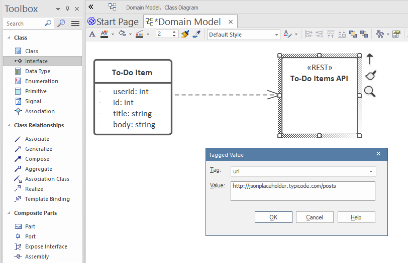
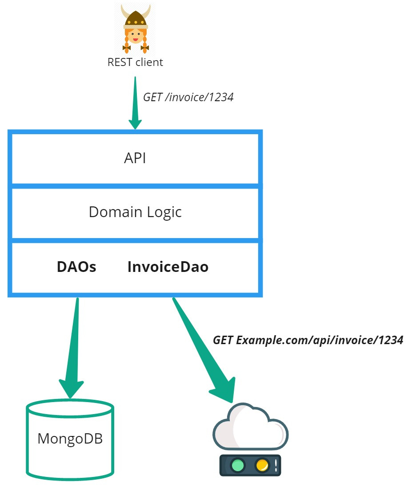
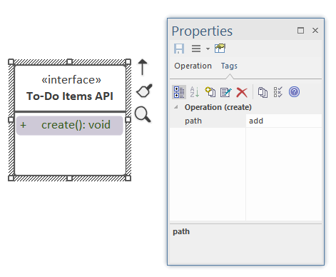

# Integrating with other REST APIs

Let's say your application needs to call out to some other REST API server - it could be a server maintained by a different team in your organisation, or a third-party REST service running on the internet. We'll generally refer to this as an "external" REST API, in the sense that it's a resource that exists outside your own generated API.

A useful test resource is [JSONPlaceholder](http://jsonplaceholder.typicode.com/), a free online REST API. We'll use it for the example on this page, as JSONPlaceholder provides example APIs that adhere perfectly to established REST conventions.


## How the generated API integrates with external systems

To define an external REST resource, think of it in terms of basic Create, Read, Update and Delete (CRUD) functions.  (CRUD functions can be thought of as the basic building blocks of REST; however you can also model more complex "task-oriented" API functions, which we'll cover later).


## Modeling an external REST API as CRUD functions

There are two concepts that need to be represented in the domain model:

* a domain class (the data entity, or data transfer object)
* the API itself

In your domain model:

1. Define the API as an Interface (a UML Class with an Interface stereotype)
2. Add a `<<REST>>` stereotype to the interface
3. Add a `url` tagged value to the interface, containing the root URL of the REST API
5. Draw a Dependency arrow from the class to the API

For example, to model the *To-Do List* REST interface from JSONPlaceholder:



Because the JSONPlaceholder API follows exact REST conventions, there's nothing else that needs to be defined. When you generate the above model, you'll get the following...

## What gets generated?

If you recall from earlier, the [generated REST API consists of a layered design](../domain-modeling/what-gets-generated), with an API layer for "database-agnostic", application-level operations, and a Data Access Layer (DAL) consisting of a DAO for each domain class. The DAOs map database operations to the MongoDB (or Oracle, or...) database. To recap:


The external REST API code fits into this layered structure. Any time a domain class is mapped to a REST Interface, instead of the usual MongoDB DAO, CodeBot instead creates a "REST" DAO:



In other words, *no MongoDB DAO is created for the domain class*. The data isn't stored in the "local" application at all, but instead all data access is delegated to the mapped REST interface.

The Domain Logic layer (and by extension the API layer) know nothing of this switcheroo, however. They don't know (or care!) where the data is written to or retrieved from, just that the data *can* be written and retrieved.

## Data attribute mapping

It's possible (likely, even) that the data returned by the external API won't precisely match your own domain data. So in some cases you'll need to define a mapping, or transform, between the two.

CodeBot "natively" supports the [node-json-transform](https://www.npmjs.com/package/node-json-transform) library for this purpose. (TODO: more details to follow...)

If the differences are more extreme, however, you can also transform the data by writing [server event handlers](../low-code/server-event-handlers).

* For data being written, create `onCreate`, `onReplace` and `onUpdate` Operations on your domain class. This code should map your data structure to the external API's data structure.
* For data being read, create an `onRead` Operation on your domain class. This code should map the external API's data structure to your data structure.


## Tailoring the external API endpoints

Of course, REST itself isn't a standard as such, just a well-known set of conventions. Not every system your app integrates with will follow the same conventions precisely - many APIs can be considered "merely REST-like", or "JSON (or XML) over HTTP". So some level of tailoring will almost certainly be needed.

To tailor each individual CRUD endpoint:

1. Add an empty Operation (no code required) to the Interface (NB: not the domain class!)
2. Give the Operation a tagged value

e.g. to tailor the "create" endpoint:



The above `path` tag will result in the full URL for "create" (POST) calls being:

```http
http://jsonplaceholder.typicode.com/posts/add
```

Note the "/add" appended to the base URL. The URL itself was defined as a tag on the parent Interface.

You can also override the entire URL for each endpoint, by using `url` for the Operation tag instead of `path`.

> The [full set of methods and tailorable Operations](../../codebot-reference/external-rest-endpoints) can be found in the [CodeBot Reference](../../codebot-reference/) section.


> **[> Next: Custom UI state behavior functions](ui-behavior-functions)**
