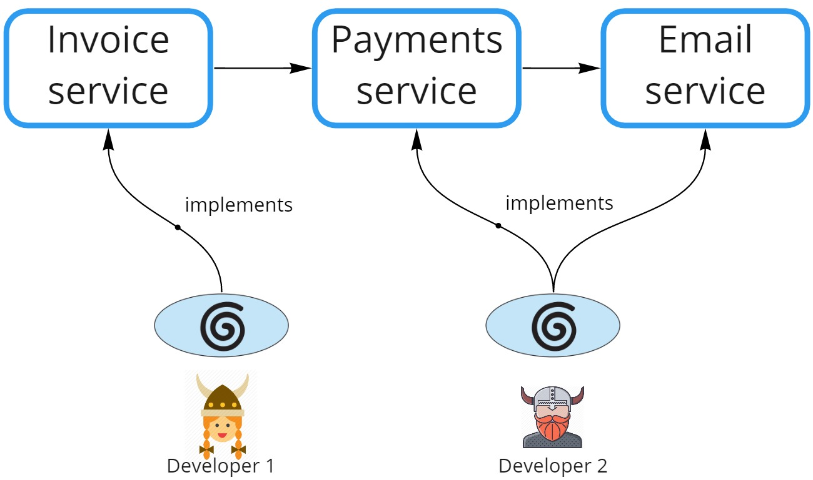
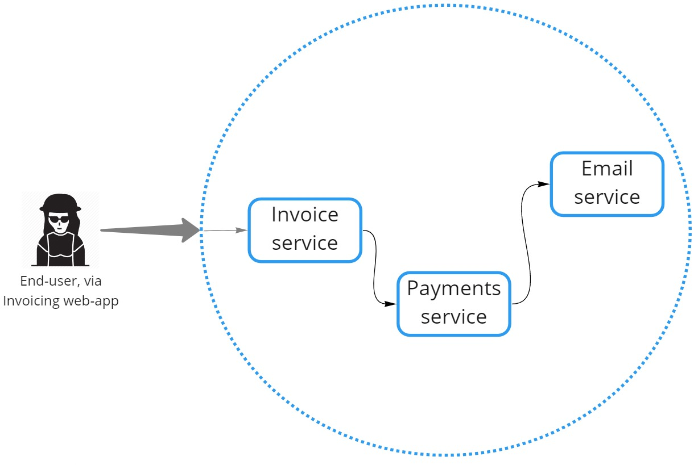
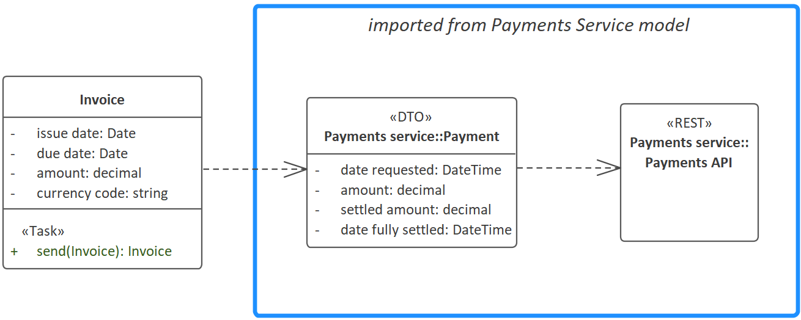

# REST Microservices

CodeBot facilitates multiple developers, or teams of developers, to work in parallel. Each developer/team picks a use case to implement. The use case may consist of one or more services (Invoice service, Payment service etc).

> CodeBot can also be used for message-based microservices (CQRS/event-sourcing, ESB architecture etc). The API Layer is simply replaced with an message consumer; and the Data Access Layer is replaced with a message producer. However for now, this page focuses on REST microservices.



In the above diagram, **Developer 1** is working on a use case, let's say "Generate invoices". She uses CodeBot to implement the `Invoice service`. Meanwhile **Developer 2** is working on a use case, let's say *"Initiate and send payment request"*. He uses CodeBot to implement the `Payment service`, and previously created the `Email service`, which he updates to complete the current use case.

Also in the above diagram: `Invoice service` sends a "create payment" request to `Payments service`, which in turn requests that an email notification be sent via `Email service`.

A high-level deployment view could look like this:



The blue dotted circle represents the VPC or system boundary. Requests would be routed to the relevant "allowed" service based on the HTTP path.

The key here is that, if CodeBot is generating all 3 services, they're intrinsically compatible, so integrating the other services into your own domain model becomes pretty straightforward.

## Interfacing with another microservice from your domain model

If you're modeling the Invoice service and want to integrate the Payments service, here's how you do it:



We've imported `Payment` and `Payments API` (an interface) from Developer 2's Payments Service model. We then drew a dependency arrow from Invoice to Payment (although this step is optional - see below).

> The `<<DTO>>` (Data Transfer Object) stereotype means that the `Payment` domain class won't have its own set of database CRUD functions generated here. This is important, as we don't want to have `Payment` data being persisted by the Invoice service.

> Probably worth noting, the logical "opposite" to `<<DTO>>` is `<<Entity>>`, which can be used as an override in some cases to ensure that a database CRUD module *is* generated for the domain class in question.

Because the `Payments API` interface has no operations defined, we know that it's just using the default [CRUD operations](../../codebot-reference/crud-operations). In this example, we want the Invoice.send(invoice) task to initiate a payment request via the Payments service. So we can use the default `Payments API.create(payment)` function.

To achieve this, we've written a few lines of "glue code" in the `Invoice.send` operation:

```JavaScript
let payment = {
	dateRequested: Date.now(),
	amount: invoice.amount,
	settledAmount: 0
}

let created = await Apps.payment.create(payment)

if (created.resultType == ResultType.ok) {
    return ok(payment) // return the correct entity type from this service
} else {
    return created // if create failed, return the reason
}
```

> `Apps` is a handy object that contains a reference to all of the generated application-layer modules in this service. Because `Payment` has been imported, this includes a generated `Payment` application-layer module.

The above code has an `invoice` object, because `invoice` is an input parameter on the Operation.

The code first maps the `invoice` to a new `payment` object, which it then sends to the Payments service, via the generated `create(payment)` function.

> Of course, the code starts to grow when you add error handling, so we've tried to keep the above example succinct, just to illustrate how to integrate one service with another.

The dependency arrow between `Invoice` and `Payment` is optional, as we've written the "glue code" manually; however it can be left in for documentation purposes, so you can see at a glance that `Invoice` uses `Payment`.

> Dependency arrows between domain classes are allowed but have no material effect.


## Additional thoughts on microservice integration

'Integration of microservices developed in parallel' is a pretty much endless source of thought and discussion... however, for now, here are some additional factors to think about...

### Use LemonTree to manage the interfaces and DTOs via Components

Using LemonTree, the above approach is further simplified. Developers can export the relevant classes/interfaces as LemonTree components, and commit them into a shared Git repository. From there, another developer can simply get the latest components, and import them into their own model, ready to use.

In particular, this allows developers to continue working on their own microservices in parallel, keeping the team in sync using standard Continuous Integration (CI) practices.


### Correlation ID

When passing requests or messages/commands along between services, you might well want to create a "correlation ID" at the request boundary. This can be incredibly useful for trace logging, and later tracking down the progress of an individual request as it weaves its way through the various services.

The correlation ID can simply be an optional attribute on each DTO; it's then passed along in the request to the next service, as long as the service "glue code" maps the attribute to the next request object.


### Trustless services

Usually, each service will need to know the identity of the user who initiated the "boundary request". As with the correlation ID, the logged-in user ID may be passed along to each service in the "request chain" -- assuming the user was authenticated at the boundary.

This is fine if you trust that the boundary is impenetrable except via the accepted route... and that no further "trust checks" are needed inside the VPN or "trust zone".

However, it's seen as much better practice to have each individual service require user authentication of some sort.

If you're using JWT, and the services all share the same private key, then the same token can be passed along and authenticated individually by each service.

An alternative is to create a single Authentication service (basically, SSO), and have each service individually check the Authentication service for each request. This would be preferable if the idea of multiple services sharing the same private JWT key doesn't appeal.

As with microservice integration generally, inter-service authentication (and trustless services in particular) is an endless topic, but we wanted to introduce the discussion here, as the implementation choices really extend beyond what CodeBot generates, but do need consideration for any deployed system.


--

From here, the tutorial trail weaves back to Low-Code for UI behaviour:

> **[> Next: Custom UI state behavior functions](../low-code/ui-behavior-functions)**
