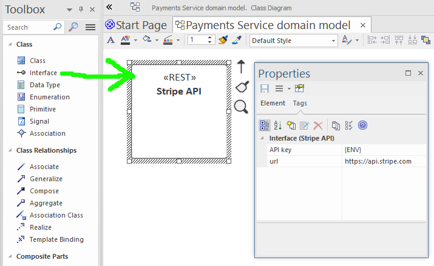

# REST API Task Endpoints

Earlier in the tutorial we covered how to model and generate a [task-based REST API](../low-code/task-oriented-apis). Task-based APIs are the recommended way of modeling desired system behavior, rather than CRUD APIs.

We also covered how to model and generate an integration with [external REST APIs](crud-rest-apis) that implement REST CRUD behavior (create/read/update/delete operations).

In this section we essentially bring the two together, and explore how to integrate your domain service with an external REST API which itself has task-based API endpoints.

## Example: Stripe Payments API

Let's use an example that has some real-life utility: transacting credit card payments via the [Stripe API](https://stripe.com/docs/api).

### First step: Define an Interface

As with defining an external CRUD API, create a UML Interface to represent the Stripe API:

We've also added a `url` tagged value to hold the base URL, and an `API key` tagged value for the private key used to authenticate each request.

The key needs to be kept private - you definitely wouldn't want it to be held in the model itself, as the model will be shared around, kept in version control, etc. So `{ENV}` indicates that the key should be read from an environment variable by the deployed service at runtime.

Without any operations defined, you'd normally get the default set of CRUD operations generated on the interface, for any linked domain classes... Of course, we haven't linked a domain class yet. But we also don't want CRUD ops here, we want to define specific task operations.

### Second step: Define the Stripe task operations

To model the payment workflow, we need a `PaymentIntent` class, plus a class to represent the response.

Starting with the `PaymentIntent` JSON object, [documentation here](https://stripe.com/docs/api/payment_intents/object)...

From the above Stripe API docs we can pretty easily map this to a domain class, like so:

### Using Stripe's own Node library

In this example we've simply connected to Stripe using the generated JavaScript code. However if you prefer, you can integrate Stripe's "official" library.

To do this, there are 2 steps:

1. Add a Node dependency to the interface
2. Customise the DAO code to use the Stripe library

> **[> Next: Generating a network of REST microservices](microservices)**
