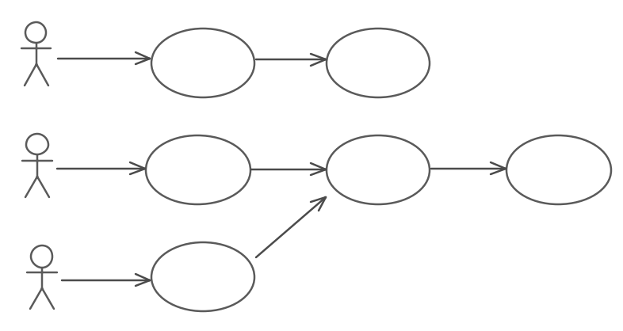

# Process Guide - Parallel Agile

## Faster Delivery, Fewer Defects, Lower Cost

In this guide we'll provide an overview of Parallel Agile (PA), and how your project can use it to scale out efficiently to multiple large teams.

Some supposedly scalable agile development processes build on a notably non-scalable core, with additional practices to "add scalability" - which really means "add more processes and ceremonies". However, PA is different, in that it was designed from the ground up for large-scale projects - without adding undue process or ceremony.

Heretical though it may sound, PA's approach means that high levels of communication overhead (e.g. daily scrums and sprint retrospectives) just aren't needed. As a result, PA also works remarkably well on smaller projects!

## How it's done

So, how exactly *does* PA help you to both reduce time-consuming agile ceremony *and* organise large-scale projects?

There are three fundamental parts:

* Communication when it matters most - early in the project
* Effective partitioning of work
* Shared domain model
* CodeBot!

(Okay, *four* fundamental parts...)

The reason agile projects tend not to scale well is that everyone on the team is required to know everything about what everyone else is doing. (Yes that's something of an exaggeration, but it isn't far from the truth either)... While being inefficient from the outset, as soon as your project grows beyond 4 or 5 developers, the process starts to break apart. Communication barriers start to get in the way - like office walls and Internet connections.

We're not saying that team members shouldn't communicate - far from it - but if the communication is done at the right times and in the right way, you'll find that you don't need all those time-consuming retros and team huddles.

PA uses a shared domain model, along with use cases to help partition work among your team. Each developer is responsible for delivering one use case.

Each use case is managed like a miniature "spiral model", like a self-contained project in its own right. Development of the use case starts with an initial proof-of-concept, progresses through Minimum Viable Product (MVP), and finally to an optimisation/testing & fixing phase. The emphasis is on providing feedback early and often.

This is, of course, where the "parallel" bit happens. Because each developer works on an individual use case, work is partitioned sensibly across multiple development "threads". However, the team retains a shared understanding of the project architecture and goals; so no-one is "working in a vacuum", so to speak.

The code, domain model etc are integrated and kept in sync as often as possible, via a CI pipeline. So integration issues are quickly resolved before they become a problem.

## Parallel Agile Book

Check out our book, recently published:

> [Amazon.com](https://www.amazon.com/Parallel-Agile-faster-delivery-defects-dp-303030700X/dp/303030700X)
> 
> [Amazon.co.uk](https://www.amazon.co.uk/Parallel-Agile-faster-delivery-defects/dp/303030700X)

## Training

We also offer [training courses on the PA development process](http://www.parallelagile.com/training.html) combined with domain-driven code generation using CodeBot, to accelerate your project and help reduce bugs.

Our training courses are practical and hands-on, and can be adapted to fit your project. By the end of the course, the participants will have learned essential domain modeling and agile development skills.

Training can be online via Zoom or in person at your office.
